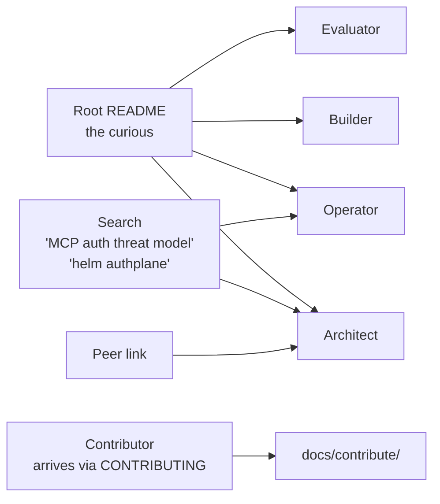

# Authplane Documentation

Authplane is a self-hosted OAuth 2.1 + MCP Authorization (spec 2026-07-28)
server delivered as a single Go binary. For the product pitch, see the
[root README](../README.md).

## Pick your lane

If none of the lanes below fit, jump to [Reference](#reference-everyone) or
the [Glossary](concepts/glossary.md).

## Evaluator lane

For someone shopping for an MCP authorization solution who wants enough
context to decide *whether* to dig deeper — before getting into RFCs,
topology trade-offs, or SDK code. Target time: 5–15 minutes.

| Question | Where to look |
| --- | --- |
| What problem does Authplane solve? | [What is Authplane?](concepts/what-is-authplane.md) — 60-second overview |
| What does the network look like? | [Topology decision tree](topologies/) — picks a deployment shape from your constraints |
| When should I use Authplane (and when not)? | [Threat model](concepts/threat-model.md) + [Broker vs Mint](concepts/broker-vs-mint.md) — the two scope decisions |
| What SDKs exist today? | [Root README → SDKs](../README.md#sdks) — Go, TypeScript, Python, Java, C# with package names; [`llms.txt`](../llms.txt) has the versions to pin |
| What's coming next? | [ROADMAP.md](../ROADMAP.md) — staged by how far along each item is |
| What can I run in 15 minutes? | [Quickstart](start/02-quickstart-docker.md) → tier-01 retrofit ([Python](../examples/python/retrofit-existing-mcp-server/) · [TypeScript](../examples/typescript/retrofit-existing-mcp-server/) · [Go](../examples/go/retrofit-existing-mcp-server/)) |

Convinced? Pick a deeper lane below. Still evaluating? The [Architect
lane](#architect-lane) goes one click deeper without leaving theory.

## Builder lane

For developers adding Authplane to an MCP server or agent.

| Get started fast | Go deeper |
| --- | --- |
| [Quickstart](start/02-quickstart-docker.md) — 5-min Docker setup | [Tutorial: your first MCP server](start/) |
| [Examples (3 languages x 4 tiers + retrofit)](../examples/) — Python · TypeScript · Go, runnable | [Integrate guides](guides/integrate/) |
| [Retrofit existing MCP server](../examples/python/retrofit-existing-mcp-server/) — before/after diff, all 3 langs | [Connect an MCP Server guide](guides/integrate/connect-mcp-server.md) |
|  | [Upstream providers (GitHub, Slack, ...)](guides/upstream-providers/) |
|  | [Federation (Okta, Entra ID, ...)](guides/federation/) |

Recommended reading order: Quickstart -> your-language tier-01 example
([Python](../examples/python/01-mcp-server-basic/) · [TypeScript](../examples/typescript/01-mcp-server-basic/) · [Go](../examples/go/01-mcp-server-basic/))
-> the integrate guide for your stack -> tier-02/03/04 if you need to call
another resource, add DPoP + per-tool scopes, or front a Broker upstream.

## Operator lane

For SREs deploying and running Authplane.

| First deploy | Day-2 |
| --- | --- |
| [Deploy -> Docker Compose](guides/deploy/docker-compose.md) | [Operate -> Admin CLI](guides/operate/admin-cli.md) |
| [Deploy -> Helm](guides/deploy/helm.md) | [Operate -> Key rotation](guides/operate/key-rotation.md) |
| [Deploy -> systemd](guides/deploy/systemd.md) | [Operate -> Audit & forensics](guides/operate/audit-and-forensics.md) |
| [Deploy -> Configuration](guides/deploy/configuration.md) | [Operate -> Incident runbook](guides/operate/incident-runbook.md) |
| [Deploy -> Vault Transit](guides/deploy/hashicorp-vault-transit.md) | [Deploy -> Backup & purge](guides/deploy/backup-and-purge.md) |

Concept-level grounding: [Threat model](concepts/threat-model.md),
[Token design internals](guides/operate/token-design-internals.md).

## Architect lane

For evaluators picking a topology + understanding the trust model.

| Mental model | Decisions |
| --- | --- |
| [What is Authplane](concepts/what-is-authplane.md) | [Topology decision tree](topologies/) |
| [Resources and scopes](concepts/resources-and-scopes.md) | [Broker vs Mint](concepts/broker-vs-mint.md) |
| [Tokens and claims](concepts/tokens-and-claims.md) | [Identity and federation](concepts/identity-and-federation.md) |
| [Architecture](concepts/architecture.md) | [Threat model](concepts/threat-model.md) |
| [Glossary](concepts/glossary.md) | [Reference: HTTP API](reference/http-api.md) |

## Contributor lane

For developers extending authserver.

- [Repo tour](contribute/repo-tour.md) — what lives where
- [Hexagonal layers](contribute/hexagonal-layers.md) — where to put your code
- [Add an upstream provider](contribute/add-an-upstream-provider.md) — brokerproto Registry recipe
- [Add a grant type](contribute/add-a-grant-type.md)
- [Coding conventions](contribute/coding-conventions.md)
- [Running tests](contribute/running-tests.md)
- [Release process](contribute/release-process.md)

## For AI agents

- [`AGENTS.md`](../AGENTS.md) — deterministic in-repo workflow (read this first when cloning).
- [`llms.txt`](../llms.txt) — root-level link map following the [llmstxt.org](https://llmstxt.org/) convention, for agents operating from web docs.

## Reference (everyone)

- [`reference/cli.md`](reference/cli.md) — every CLI command + flag (generated)
- [`reference/http-api.md`](reference/http-api.md) — every endpoint + DTO (generated)
- [`reference/env-vars.md`](reference/env-vars.md) — every `AUTHPLANE_*` env var (generated)
- [`reference/configuration.md`](reference/configuration.md) — every YAML key (generated)
- [`reference/audit-events.md`](reference/audit-events.md) — every audit action and its detail keys
- [`reference/metrics.md`](reference/metrics.md) — every Prometheus / OTel instrument
- [`reference/mcp-client-compatibility.md`](reference/mcp-client-compatibility.md) — tested MCP clients
- [`reference/mcp-streamable-http.md`](reference/mcp-streamable-http.md) — the wire-level MCP handshake (3 POSTs, headers, 4xx responses)
- [`reference/flows.md`](reference/flows.md) — pointer index for OAuth / MCP flows
- [`reference/compliance.md`](reference/compliance.md) — RFC compliance matrix
- [`reference/error-codes.md`](reference/error-codes.md) — error code catalog
