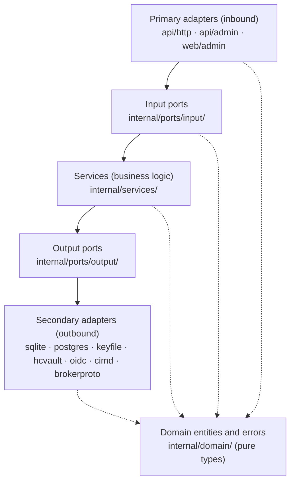

# Architecture

*Context: this is part of [Concepts](README.md). Start with the primer if you haven't.*

authserver is a single Go binary implementing an OAuth 2.1
[Authorization Server](glossary.md#glossary-authorization-server) for the
Model Context Protocol. It follows hexagonal architecture (ports and
adapters) with strict dependency rules.

This page is the conceptual map of the codebase. For the how-to side —
writing a new adapter, contributing a service — see
[Hexagonal layers](../contribute/hexagonal-layers.md).

## System overview

```
MCP Client (Claude Code)          User Browser
       │                               │
       │ 1. Discover PRM               │
       │ 2. Discover AS Metadata       │
       │ 3. Register (DCR/CIMD)        │
       ├──────────────────────────────► │ 4. Login
       │                               │ 5. Consent
       │ 6. Exchange code for tokens   │
       │                               │
       ▼                               ▼
  ┌─────────────────────────────────────────┐
  │              authserver (:9000)            │
  │                                         │
  │  ┌─────────┐  ┌──────────┐  ┌───────┐  │
  │  │Discovery│  │  OAuth   │  │ Login │  │
  │  │ AS Meta │  │Authorize │  │Consent│  │
  │  │ PRM     │  │ Token    │  │       │  │
  │  │ JWKS    │  │ Revoke   │  │       │  │
  │  └────┬────┘  └────┬─────┘  └───┬───┘  │
  │       │            │             │      │
  │  ┌────▼────────────▼─────────────▼───┐  │
  │  │           Services                │  │
  │  │  Authorize · Token · DCR/CIMD     │  │
  │  │  Consent · UserAuth · JWKS        │  │
  │  │  Admin · Audit · Introspection    │  │
  │  │  Connect · BrokerIssuer (Resources)│ │
  │  └────┬──────────────────────────┬───┘  │
  │       │                          │      │
  │  ┌────▼────┐              ┌──────▼───┐  │
  │  │ SQLite  │              │ Keyfile  │  │
  │  │Postgres │              │  Vault   │  │
  │  │AES Enc. │              │ Transit  │  │
  │  └─────────┘              └──────────┘  │
  └─────────────────────────────────────────┘

  ┌─────────────────────────────────────────┐
  │            authserver (:9001)              │
  │     Admin API + Admin UI (internal)    │
  │  Clients · Users · Tokens (4 tabs)     │
  │  Resources · Broker Providers · Keys   │
  │  Audit Log · System                    │
  │  ┌───────────────────────────────────┐  │
  │  │  Admin UI (React SPA, embedded)  │  │
  │  │  Dark/Light · Collapsible Sidebar│  │
  │  │  go:embed → single index.html    │  │
  │  └───────────────────────────────────┘  │
  └─────────────────────────────────────────┘
```

## Hexagonal architecture

### Layers



Each level imports only what's directly below it (or the domain layer);
nothing skips levels and nothing imports upwards.

For reference, the same in tabular form:

```
api/http/      api/admin/       web/admin/         Primary adapters (inbound)
  OAuth handlers  Admin REST+UI   React SPA          Import: ports/input/, domain/
internal/ports/input/                              Input ports (interfaces)
  What the world asks us to do                       Import: domain/
internal/services/                                 Business logic
  Orchestrates domain operations                     Import: ports/, domain/, crypto/
internal/ports/output/                             Output ports (interfaces)
  What we need from the world                       Import: domain/
internal/adapters/sqlite/    keyfile/   oidc/      Secondary adapters (outbound)
internal/adapters/postgres/  cimd/                   Import: ports/output/, domain/
internal/adapters/aesmaster/ connector/ hcvault/
internal/domain/                                   Domain entities and errors
  Pure business types — no dependencies              Import: stdlib only
```

### Dependency rules

| Package | Can import | Cannot import |
|---------|-----------|---------------|
| `internal/domain/` | Go stdlib, `gofrs/uuid` | Everything else |
| `internal/ports/` | `domain/` | `adapters/`, `services/`, `config/` |
| `internal/services/` | `ports/`, `domain/`, `crypto/` | `adapters/` directly |
| `api/` (handlers) | `ports/input/`, `domain/`, `config/` | `adapters/`, `services/` |
| `internal/adapters/` | `ports/output/`, `domain/` | Other adapters |
| `cmd/` | Everything | — |

`cmd/authserver/serve.go` is the orchestrator: it creates adapters, services, and handlers, wiring everything together. HTTP handlers never import services directly — they use input port interfaces.

## Request flow

A typical authorization code flow through the system:

```
1. GET /oauth/authorize
   → oauthHandler (api/http)
   → AuthorizePort.StartAuthorization (input port)
   → AuthorizeService (service)
   → ClientStore.GetByID (output port → SQLite adapter)
   → SessionStore.Create (output port → SQLite adapter)
   → Redirect to /login

2. POST /login
   → loginHandler (api/http)
   → UserAuthPort.Authenticate (input port)
   → UserAuthService (service)
   → UserStore.GetByEmail (output port → SQLite adapter)
   → bcrypt.Compare
   → Session established, redirect to /consent

3. POST /consent (approve)
   → consentHandler (api/http)
   → ConsentPort.GrantConsent (input port)
   → ConsentService (service)
   → ConsentStore.Create (output port → SQLite adapter)
   → Redirect back to /oauth/authorize → redirect to client with code

4. POST /oauth/token (code exchange)
   → oauthHandler (api/http)
   → TokenPort.ExchangeCode (input port)
   → TokenService (service)
   → SessionStore.ConsumeAuthCode (atomic, output port → SQLite adapter)
   → PKCE verification (crypto/)
   → JWT signing (crypto/ → keyfile or Vault Transit adapter)
   → TokenStore.Create (output port → SQLite adapter)
   → Return access_token + refresh_token
```

## Domain model

### Entities

| Entity | Location | Purpose |
|--------|----------|---------|
| Client | `domain/client/` | OAuth client with DCR/CIMD state machine |
| User | `domain/user/` | Local user (email/password or OIDC) |
| TokenFamily | `domain/token/` | Groups related refresh tokens for reuse detection |
| RefreshToken | `domain/token/` | Individual refresh token in a family |
| AuthSession | `domain/session/` | In-flight authorization (code + PKCE state) |
| Grant | `domain/consent/` | User's consent decision for a client+scopes |
| AuditEvent | `domain/audit/` | Security audit log entry |
| Resource | `domain/resource/` | Unified Mint/Broker resource (the `resources` table) |
| BrokerProvider | `domain/resource/` | Upstream OAuth provider registration (`broker_providers`) |
| ConsentGrant | `domain/resource/` | Per-(user, agent, resource) consent attestation |
| BrokerGrant | `domain/resource/` | Per-(user, broker_provider) upstream authorization (encrypted refresh-grant) |
| Issuance | `domain/resource/` | Forensic audit row for every Mint or Broker token issuance |

Domain entities are pure Go types with no external dependencies. Cross-domain imports are forbidden (e.g., `domain/client` cannot import `domain/token`).

### Domain errors

All domain errors live in a single file: `internal/domain/errors.go`. Each error has an OAuth error code for wire-level mapping:

| Error | OAuth code | Meaning |
|-------|-----------|---------|
| `ErrInvalidGrant` | `invalid_grant` | Expired code, wrong verifier |
| `ErrInvalidClient` | `invalid_client` | Unknown client, wrong secret |
| `ErrInvalidScope` | `invalid_scope` | Scope not declared on the target resource server |
| `ErrCodeConsumed` | `invalid_grant` | Auth code replay |
| `ErrFamilyRevoked` | `invalid_grant` | Refresh token theft detected |
| `ErrInvalidPKCE` | `invalid_grant` | PKCE verification failed |
| `ErrRateLimited` | `slow_down` | Too many requests |

## Unified Resource model

Every resource the AS speaks to is one row in the `resources` table, discriminated by `backend_kind`:

- **`mint`** — the AS issues an AS-signed JWT for a downstream MCP server (the historical "resource server" path).
- **`broker`** — the AS vends an upstream-provider access token via RFC 8693 token exchange, gated by the three-bound consent model.

`BrokerProvider` rows define the upstream OAuth providers; one Broker resource references one provider via `broker_provider_id`. The `BrokerProtocol` port (`internal/ports/output/broker_protocol.go`) is satisfied by sibling-package adapters at `internal/brokerproto/{oauth,api_key,service_account}` (registered via the `brokerproto.Registry` per ADR-001).

### Connect flow (user-facing)

```
User Browser                      authserver
      │                                │
      │  1. GET /connect/github        │
      │  2. OAuth flow with upstream   │
      │  3. Callback → broker_grants  │
```

`ConnectService.StartConnect` and `CompleteConnect` orchestrate the OAuth handshake with HMAC-signed state tokens and persist an encrypted `broker_grants` row.

### Exchange flow (MCP server-facing)

The MCP server obtains an upstream provider token through the standard `POST /oauth/token` endpoint using RFC 8693 token exchange with `resource=<provider-slug>`:

```
MCP Server                        authserver
      │                                │
      │  POST /oauth/token             │
      │    grant_type=token-exchange    │
      │    subject_token=<user JWT>    │
      │    resource=github             │
      │    scope=repo                  │
      │    client_id=MCP_SERVER_ID     │
      │    client_secret=MCP_SECRET    │
      │                                │
      │  ← { access_token: "gho_xxx", │
      │       token_type: "Bearer",    │
      │       expires_in: 3600 }       │
```

`TokenExchangeService.Exchange` resolves the resource, then dispatches via the `Issuer` interface (`MintIssuer` for Mint resources, `BrokerIssuer` for Broker resources). A direct-Broker vend is bounded twice, and the two bounds live in different components:

> requested ⊆ `consent_grants.scopes` (per-agent attestation) — enforced by `dispatchBroker`, inside the agent-attestation gate, before any issuer runs
> ⊆ `broker_grants.scopes_granted` (per-provider grant) — enforced by `BrokerIssuer`

Which component owns which bound is what makes the fronted path differ: because the `consent_grants` bound lives in dispatch rather than in the issuer, a fronted Mint→Broker exchange never reaches it — dispatch hands off to the fronted-broker path right after the operator gate — so the fronting link's `scope_map` and the `broker_grants` ceiling are what bound that vend. `BrokerIssuer` reads no consent state on either path.

Failures emit `error=consent_required` with a `cause` sub-discriminator (`consent_missing` | `scope_insufficient`) and a `consent_url` that flips between `/connect/{provider}` (upstream re-auth) and `/authorize?resource=...` (AS-side re-consent) based on which bound failed.

**Per-resource exchange policy:** Each resource carries `policy.exchange.allowed_client_ids`. Empty means any client exchanging a token issued to *itself*; a client presenting a token minted for a different client must be listed explicitly on the direct Mint path, because the consent row that authorizes the exchange belongs to the subject token's client. User consent is a separate gate, skipped for Mint self-exchange and on fronted paths — Mint→Mint and Mint→Broker alike (there the operator's fronting declaration and its `scope_map` stand in for the consent row).

**Encryption:** Upstream refresh-grants are encrypted at rest with AES-256-GCM or HashiCorp Vault Transit.

**Client SDKs:** The unified `AuthServer` SDK (Go, TypeScript, Python, Rust) exposes an `Exchange(provider, scopes)` method that performs the token-exchange call and decodes the `consent_required` cause + consent_url for you. See [Connecting upstream providers](../guides/upstream-providers/connecting-providers.md) for setup and usage.

## Authentication

authserver uses 5 authentication models across its endpoints: unauthenticated (public discovery), session cookie (user-facing pages), Bearer JWT (resource server calls), API key (admin), and client credentials (confidential clients at the token endpoint). For a complete mapping of which model applies to each endpoint, see the [HTTP API Reference](../reference/http-api.md).

## Storage

### SQLite (default)

Pure Go implementation via `modernc.org/sqlite` (no CGO). WAL mode enabled by default for concurrent reads. Recommended for single-instance deployments.

### PostgreSQL

Via `jackc/pgx/v5`. Required for multi-instance (HA) deployments. Migrations managed by `authserver migrate`.

Both backends implement the same output port interfaces. The storage driver is selected at startup via configuration.

## Observability

Every request is instrumented with:
- **Structured logs** (slog) with `trace_id`, `span_id`, `request_id`
- **OpenTelemetry traces** (optional) spanning HTTP → service → adapter
- **Prometheus metrics** for token issuance, auth denials, latency

See [Observability with Prometheus and OTel](../guides/deploy/observability-prometheus-otel.md) for details.

## Docker image

The production Docker image uses a multi-stage build:
1. `golang:1.26-alpine` — builds the binary
2. `gcr.io/distroless/static-debian12:nonroot` — runtime (no shell, no package manager)

The image runs as UID 65534 (nonroot), exposes ports 9000 and 9001, and is under 50MB.

## Where to go next

- [Resources and scopes](resources-and-scopes.md) — the unified resource
  data model in more detail.
- [Threat model](threat-model.md) — what each layer defends against.
- [Configuration reference](../reference/configuration.md) — every
  configurable knob.
- [CLI reference](../reference/cli.md) — every `authserver` subcommand.
