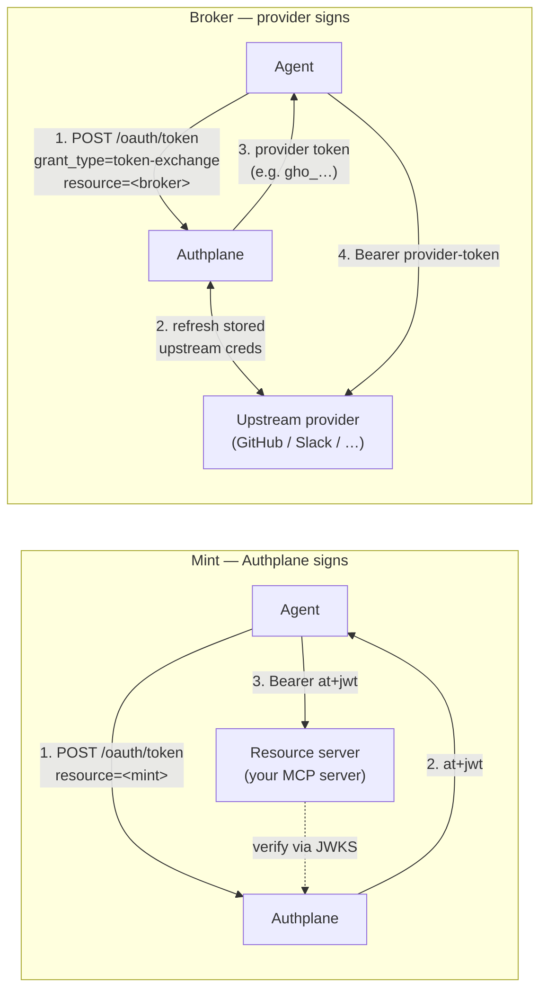
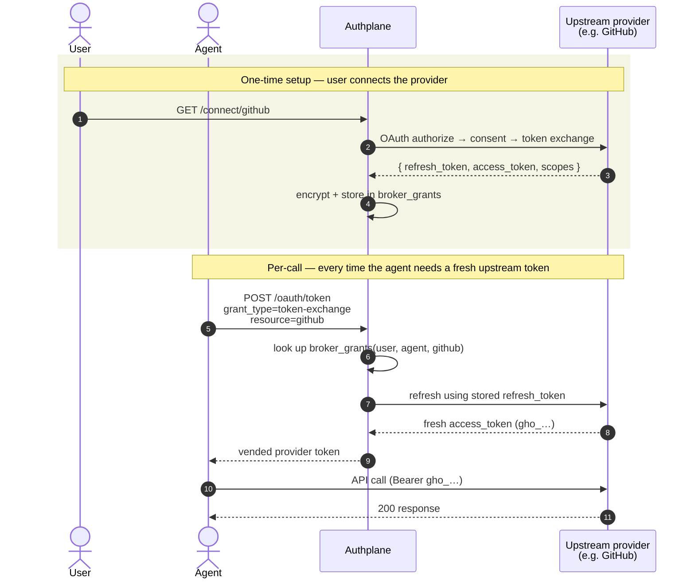

# Mint vs Broker

*Context: this is part of [Concepts](README.md). Start with the primer if you haven't.*

There are exactly two backend kinds: **Mint** and **Broker**. They answer one question: **who signs the access token Authplane vends?**

- A **[Mint resource](glossary.md#glossary-mint-backend)** is a resource that Authplane mints tokens FOR. Authplane is the issuer; the token is an `at+jwt` JWT signed by Authplane's JWKS; the resource server validates it directly.
- A **[Broker resource](glossary.md#glossary-broker-backend)** is a resource backed by a third-party provider (GitHub, Slack, Google, Notion, …). Authplane **delegates** token minting to that provider — when an agent requests a token for the resource, Authplane brokers the OAuth dance with the provider on the user's behalf and vends the provider's native token (e.g. `gho_…` from GitHub).

Both are reached via `POST /oauth/token` with a resource indicator. They differ only in who is at the other end of the resource. (See [`api/admin/dto.go`](../../api/admin/dto.go) for the wire shape; the on-disk YAML field is `backend_kind`, validated against the two constants in [`internal/domain/resource/resource.go`](../../internal/domain/resource/resource.go).)

## At a glance

|  | Mint | Broker |
|---|---|---|
| Who signs the token? | Authplane | The upstream provider |
| Token format | AS-signed JWT (`at+jwt`) | The provider's native token (e.g. `gho_…` for GitHub; opaque elsewhere) |
| What the resource server validates against | Authplane's [JWKS](glossary.md#glossary-jwks) | The provider's API |
| Does Authplane hold provider credentials? | No | Yes — the upstream OAuth refresh token is encrypted at rest in `broker_grants` |
| Who consents? | The user consents once for the agent on this resource | The user consents on the AGENT *and* connects the PROVIDER |
| Typical use | Your MCP server | Calling third-party APIs as the user |

Side by side:



In the Mint case, the resource server never talks to a third party — it trusts Authplane's signature and that's it. In the Broker case, Authplane is the OAuth broker: it holds the user's encrypted refresh token, talks to the provider, and hands the agent a token the provider itself minted.

## How Broker works under the hood

Broker has two phases: a one-time per-user setup (the user connects the provider) and a per-call exchange. Authplane stores the upstream OAuth refresh token encrypted at rest in `broker_grants` and uses it to refresh the upstream access token whenever an agent asks for one.



Two consequences worth noting:

1. **Revocation is fast.** When the user revokes the upstream OAuth grant at the provider, the next refresh fails — and the agent's next call gets `consent_required` immediately. No long-lived stale tokens sitting in agent memory.
2. **The agent never sees the upstream refresh token.** Only the per-call access token. That keeps the blast radius of a leaked agent-side credential bounded.

## Fronting — a relationship between a Mint and a Broker

There's a third configuration that is NOT a third backend kind: a **[fronting link](glossary.md#glossary-fronting-link)** between a Mint resource and a Broker resource. The Mint is the "front"; the Broker is the "back".

You add a fronting link when:

- A Mint MCP server has its own local tools (handled by Mint-issued tokens, normal Mint flow), **and**
- The same MCP server *also* needs to call the Broker's provider on the user's behalf (e.g. a `tools/summarize_my_prs` tool that needs a GitHub token).

Without a fronting link, the agent would have to acquire tokens for the Mint AND the Broker separately. With one in place, the MCP server can take its Mint-issued token and exchange it for a Broker-vended token via RFC 8693 — the user's consent on the Mint flows through to the Broker.

The mechanism is a `FrontingLink` row defined in [`internal/domain/resource/fronting_link.go`](../../internal/domain/resource/fronting_link.go):

- `source_slug` — the Mint resource that "fronts"
- `target_slug` — the Broker resource that's fronted
- `scope_map` — declares which Mint-side scopes map to which upstream scopes on token exchange (e.g. `{"tools/summarize_my_prs": ["repo", "read:user"]}`)

Fronting changes nothing about what Mint or Broker ARE — both remain themselves; the link is metadata that authorises the exchange between them.

Fronting links are admin-API-only (no YAML config block); see [`POST /admin/fronting`](../reference/http-api.md#http-admin-fronting-create).

End-to-end, a Mint-fronts-Broker tool call looks like this:

```mermaid
sequenceDiagram
    autonumber
    actor Ag as Agent
    participant AS as Authplane
    participant MCP as MCP server<br/>(Mint: mcp-server-prod)
    participant GH as GitHub<br/>(Broker: github)

    Note over MCP,AS: FrontingLink:<br/>source=mcp-server-prod, target=github<br/>scope_map: { tools/summarize_my_prs: [repo, read:user] }

    Ag->>AS: POST /oauth/token<br/>resource=mcp-server-prod<br/>scope=tools/summarize_my_prs
    AS-->>Ag: at+jwt (Mint token)

    Ag->>MCP: POST /mcp tools/call<br/>(Bearer at+jwt)
    MCP->>MCP: verify Mint token against JWKS<br/>tool requires GitHub access

    rect rgb(240, 240, 250)
        Note over MCP,GH: MCP server token-exchanges to reach GitHub
        MCP->>AS: POST /oauth/token<br/>grant_type=token-exchange<br/>subject_token=&lt;agent's at+jwt&gt;<br/>resource=github
        AS->>AS: FrontingLink authorises the exchange<br/>scope_map translates tools/summarize_my_prs<br/>→ repo + read:user
        AS->>GH: refresh stored upstream creds
        GH-->>AS: gho_…
        AS-->>MCP: gho_…
    end

    MCP->>GH: GET /user/pulls (Bearer gho_…)
    GH-->>MCP: PR list
    MCP-->>Ag: summary
```

The key idea: the agent presented ONE token (to the Mint), and the user consented ONCE (on the Mint). The MCP server then walks the fronting link on the agent's behalf, propagating the user's identity (`subject_token`) and translating scopes via the link's `scope_map`. The agent never holds a GitHub token; it never needs to.

## Consent failure modes

Both Mint and Broker can return `consent_required` from `POST /oauth/token`, but the situations differ. The response carries a `cause` field plus a `consent_url`. Two `cause` values are currently used per [`api/shared/errors.go`](../../api/shared/errors.go): `consent_missing` (the relevant grant row does not exist) and `scope_insufficient` (the row exists but the requested scopes exceed what was consented).

### Mint — `consent_required`

The user has not yet consented to this agent calling this resource with these scopes.

| `cause` | What's missing | `consent_url` points to |
|---|---|---|
| `consent_missing` | No `consent_grants` row for (user, agent, resource) | AS-side `/authorize?resource=…&scope=…` |
| `scope_insufficient` | Row exists; requested scopes exceed what was consented | AS-side `/authorize` with the gap scopes |

### Broker — `consent_required` (more places to fail)

Broker token exchange has additional checks. Any of these can return `consent_required`:

| What's missing | `cause` | `consent_url` points to |
|---|---|---|
| Agent isn't authorised to call this Broker (no `consent_grants` row) | `consent_missing` | AS-side `/authorize?resource=…&scope=…` |
| Requested scopes exceed the agent-side consent | `scope_insufficient` | AS-side `/authorize` with gap scopes |
| User has not connected the upstream provider, or the grant was revoked | `consent_missing` | Upstream `/connect/{provider}` |
| User's upstream connection doesn't cover the requested scopes | `scope_insufficient` | Upstream `/connect/{provider}` to re-consent |

Clients that don't care about distinguishing can open `consent_url` in all four scenarios. Clients that want to be smarter can branch on `cause` + the URL shape (AS-side `/authorize` vs `/connect/<provider>`).

## Coexistence in one deployment

A single Authplane instance commonly hosts both kinds. The YAML config below seeds two resources; the fronting link between them is created via the admin API afterwards.

```yaml
# config.yaml — note the YAML field is `uri`, not `aud`
# Validated against internal/config/config.go::ResourceConfigUnified

resources:
  - slug: mcp-server-prod
    backend_kind: mint
    uri: https://mcp.example.com
    display_name: "Production MCP server"
    scopes:
      - { name: mcp:echo,             description: "Echo back input" }
      - { name: tools/summarize_my_prs, description: "Summarise the user's open PRs" }
    policy:
      exchange:
        # any client may exchange tokens for this Mint (consent is a separate gate)
        allowed_client_ids: []

  - slug: github
    backend_kind: broker
    broker_provider_slug: github
    display_name: "GitHub API (per-user)"
    scopes:
      # ScopeConfig.Upstream is a string — the upstream scope name at the provider
      - { name: repo,      upstream: repo,      description: "Repository contents" }
      - { name: read:user, upstream: read:user, description: "User profile" }
    policy:
      exchange:
        # restrict who may exchange for the Broker — only the MCP server
        allowed_client_ids: ["mcp-server-prod"]
```

Then create the fronting link via the admin API (cited against [`POST /admin/fronting`](../reference/http-api.md#http-admin-fronting-create)):

```bash
curl -X POST http://localhost:9001/admin/fronting \
  -H "Authorization: Bearer $AUTHPLANE_ADMIN_API_KEY" \
  -H "Content-Type: application/json" \
  -d '{
    "source_slug": "mcp-server-prod",
    "target_slug": "github",
    "scope_map": {
      "tools/summarize_my_prs": ["repo", "read:user"]
    }
  }'
```

A typical agent workflow then:

1. User authenticates with the agent → Authplane mints a Mint token for `mcp-server-prod` covering `tools/summarize_my_prs`.
2. The MCP server validates the token locally (Mint flow ends here).
3. To fulfil `tools/summarize_my_prs`, the MCP server exchanges its Mint token against the `github` resource. The fronting link authorises the exchange; the scope map translates `tools/summarize_my_prs` → `repo read:user`.
4. Authplane returns the user's GitHub `gho_…` token. The MCP server calls the GitHub API directly.
5. If the user later revokes the GitHub connection, the next exchange returns `consent_required` with `cause=consent_missing` and `consent_url` pointing at `/connect/github`.

## Where to go next

- [Resources and scopes](resources-and-scopes.md) — the data model behind both backend kinds.
- [Delegation and agent chains](delegation-and-agent-chains.md) — what the `subject_token` represents in a token exchange.
- [Token exchange recipe](../guides/upstream-providers/token-exchange-grant.md) — runnable curl recipes.
- [Topologies](../topologies/README.md) — worked deployment shapes including the fronted Mint → Broker pattern.
