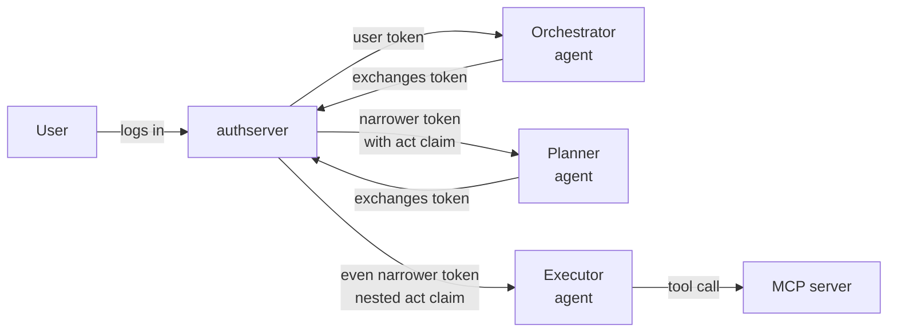

# Delegation and agent chains

*Context: this is part of [Concepts](README.md). Start with the primer if you haven't.*

Most of the time a token represents "this user, calling this resource."
But AI workflows are rarely that simple — an [orchestrator](glossary.md#glossary-agent)
hands off to a planner, which hands off to a tool-executor. Each hop is a
new actor acting on behalf of the original user. **Token exchange** is the
OAuth mechanism (RFC 8693) that lets that handoff happen without ever
re-prompting the user.

## The plain-English version



Each exchange:

1. The current holder presents its access token as `subject_token` at
   `/oauth/token` with `grant_type=urn:ietf:params:oauth:grant-type:token-exchange`.
2. authserver verifies the subject token, checks who's allowed to act for
   the target resource, and mints a new token.
3. The new token's `sub` is still the original user. Its
   [`act` claim](glossary.md#glossary-act-claim) records who performed the
   exchange. Its scope is **never wider** than the subject's.

## Why a separate mechanism

You could imagine just passing the original user token down the chain. Two
reasons we don't:

- **Audience binding.** Each hop is calling a different resource — maybe
  even a different MCP server. The original token's `aud` doesn't match.
- **Accountability.** When something goes wrong, the audit log must answer
  "which agent issued the destructive tool call?" — not just "which user
  authorized this session three hops ago." The `act` claim gives you that
  chain.

## The `act` claim — nested

Each exchange wraps the previous one:

```json
{
  "sub": "user-uuid-v7",
  "client_id": "executor-agent",
  "scope": "mcp:echo",
  "act": {
    "sub": "executor-agent",
    "actor_type": "agent",
    "act": {
      "sub": "planner-agent",
      "actor_type": "agent",
      "act": {
        "sub": "orchestrator",
        "actor_type": "agent"
      }
    }
  }
}
```

**Outermost `act` is the most recent actor.** Per RFC 8693 §4.1 ¶6, only
the **outermost** actor is authoritative for authorization decisions. Inner
hops are informational — useful for audit and display, but your MCP server
MUST NOT make access-control decisions based on them.

`actor_type` is `"agent"` if the acting client has `is_agent: true`,
otherwise `"service"`. authserver stamps it on the new outermost hop only;
inner hops are passed through unchanged.

## The `agent_chain` claim — flat

The nested `act` is technically complete but inconvenient. authserver also
emits a flat, ordered list:

```json
{
  "sub": "user-uuid-v7",
  "agent_id": "executor-agent",
  "agent_chain": [
    "orchestrator",
    "planner-agent",
    "executor-agent"
  ]
}
```

[`agent_chain`](glossary.md#glossary-agent-chain) reads left to right:
first entry is the originator, last entry is the current actor. Same
information as walking the nested `act`, but trivial for the MCP server to
consume:

```go
// Only allow direct agents (no sub-delegation) for sensitive tools
if len(claims.AgentChain) > 1 && isSensitiveTool(toolName) {
    return errors.New("sub-delegated agents cannot call sensitive tools")
}

// Rate limit by the root agent
rateLimitKey := claims.AgentChain[0]
```

## Chain depth limits

```
With max_chain_depth = 4:
User → Agent A → Agent B → Agent C → Agent D   ✅ allowed (depth 4)
User → Agent A → Agent B → Agent C → Agent D → Agent E   ❌ rejected with chain_too_deep
```

The default is 4. Increase only if you have a real need; deep chains are
hard to audit and reason about. Per Authplane convention, the
`agent_chain` list itself is capped at 8 entries with truncation of the
oldest, but `max_chain_depth` should catch problems earlier.

## Who's allowed to exchange

When a client requests a token exchange against a **registered** resource,
the gates run in sequence — operator allowlist (3 below), subject-scope
ceiling, user consent (skipped for Mint self-exchange and on fronted
paths, Mint→Mint and Mint→Broker alike); see
[Token Exchange grant → Step 3](../guides/upstream-providers/token-exchange-grant.md#step-3-gate-the-resource-with-policyexchangeallowed_client_ids).
When `resource` is omitted (legacy fall-through), only (1) can authorize
the exchange. A cross-client exchange there is refused outright: naming a
resource is what routes the request to the operator gate in (2).

1. **Self-exchange** — `allow_self_exchange: true` AND the requesting
   client's `client_id` matches the subject token's `client_id`. Used for
   scope narrowing (a service that has a broad token wants a narrow one).
2. **Per-resource policy** — the target resource's
   `policy.exchange.allowed_client_ids` includes the acting client. An
   empty list allows any client to exchange a token that was issued to
   *itself*. Delegating another client's token on the direct Mint path is
   different: there the acting client must be named, because the
   consent grant that authorizes the exchange belongs to the subject
   token's client and an operator who never named the delegate never
   authorized it to inherit that grant. Being listed in the target's
   `policy.runtime.client_ids` also satisfies it — that declares the
   caller *is* the target resource, so the token's audience and its
   holder are the same thing the user consented to reach, and there is no
   third party to name. For
   [Broker](glossary.md#glossary-broker-backend) resources, the
   three-bound [consent](glossary.md#glossary-consent) check then runs on
   top; its agent-attestation gate resolves the acting client to a
   resource of its own, so a delegate that no operator registered cannot
   reach it either.

The operator gate (3) and the legacy fall-through (1 and 2) deny with
`access_denied`. The other sequential gates fail differently: the
subject-scope ceiling returns `invalid_scope`, and the user-consent gate
returns `consent_required` (with a `consent_missing` / `scope_insufficient`
cause).

## Agent identity is opt-in

Not every client is an agent. When you create a client:

```bash
curl -X POST http://localhost:9001/admin/clients \
  -H "Authorization: Bearer $API_KEY" \
  -d '{
    "client_name": "research-agent",
    "agent": true,
    "agent_description": "Searches the web and summarizes content"
  }'
```

The `agent: true` flag is what causes [`agent_id`](glossary.md#glossary-agent-id)
to appear in issued tokens. Non-agent clients (regular services, web apps)
have no `agent_id` claim at all — the presence of the claim is itself the
signal.

The `is_agent` flag is set at registration and is **not editable** via
`PATCH /admin/clients/{id}` — to change it, delete and re-register the
client.

## Backward compatibility

- Existing tokens (issued before agent identity was enabled) continue to
  work; they just don't carry `agent_id` or `agent_chain`.
- Non-agent clients are unaffected — their tokens are identical to
  before.
- MCP servers should treat a missing `agent_id` as "the caller is not an
  identified agent" — not as an error.

## Where to go next

- [Tokens and claims](tokens-and-claims.md) — full claim shape.
- [Broker vs Mint](broker-vs-mint.md) — token exchange against a Broker
  resource vends an upstream provider token, not a JWT.
- [Token exchange recipe](../guides/upstream-providers/token-exchange-grant.md) — runnable curl
  recipes for every scenario.
- [Configuration reference](../reference/configuration.md) — the
  `token_exchange:` section.
