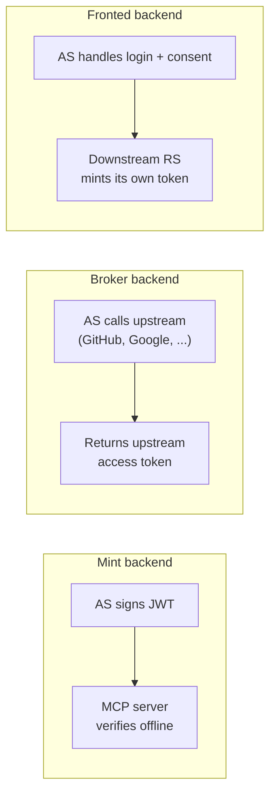

# Resources and scopes

*Context: this is part of [Concepts](README.md). Start with the primer if you haven't.*

A [resource](glossary.md#glossary-resource) is the thing authserver issues
tokens for. Every MCP server you protect, and every upstream provider you
vend tokens for, is one row in the AS's `resources` table. The
`backend_kind` column tells the AS what to do when a client requests a
token for that resource.

## The three backend kinds



| Backend | What the AS returns | When to use |
|---------|---------------------|-------------|
| [Mint](glossary.md#glossary-mint-backend) | AS-signed JWT (`at+jwt`) | Default for new MCP servers — they trust the AS's JWKS and verify offline. |
| [Broker](glossary.md#glossary-broker-backend) | The user's upstream-provider access token (e.g., a GitHub `gho_…`) | You want the MCP server to call GitHub/Slack/Google as the user, using the user's consent. |
| [Fronted](glossary.md#glossary-fronted-backend) | The AS hands off to a downstream RS that mints its own token | You have an existing resource server with its own authorization model and can't re-architect it. |

The three are not mutually exclusive within a single deployment — an MCP
server might be a Mint resource for its own tools and also call out to a
Broker resource (GitHub) on behalf of the user.

## The data model

Three tables matter:

- **`resources`** — one row per downstream system. Columns: `slug`,
  `backend_kind`, `aud` (audience URI), `scopes` (the catalog), `policy`
  (exchange allowlist), `broker_provider_id` (for Broker), `fronting_link`
  (for Fronted).
- **`broker_providers`** — registration of an upstream OAuth provider. One
  Broker resource references one provider via `broker_provider_id`.
  Configurable per-protocol via the
  [BrokerProtocol port](architecture.md#unified-resource-model) — `oauth`,
  `api_key`, or `service_account`.
- **`consent_grants`** — per-(user, agent, resource) consent attestations.
  Required before authserver will issue a token for any (user, client,
  resource) tuple.

For Broker resources, a fourth table — `broker_grants` — records the per-(user,
broker_provider) upstream OAuth grant. This is the encrypted refresh-grant
the AS uses to mint fresh upstream access tokens.

## Scopes

A [scope](glossary.md#glossary-scope) is a string in the token's `scope`
claim. Scopes are declared on the resource:

```yaml
resources:
  - slug: mcp-server-prod
    backend_kind: mint
    scopes:
      - { name: mcp:echo }
      - { name: mcp:query_database }
```

**Naming convention.** Scope names are arbitrary strings — the AS doesn't
parse them. These docs and every example in [`examples/`](../../examples/)
use `mcp:<tool_name>` to match OAuth scope conventions
(`read:user`, `write:repo`). Pick a convention and apply it consistently:
the string you put in `Resource.scopes` is the same string you'll write in
`@require_scopes(...)` on the tool handler and the same string the client
asks for on `/oauth/token`. (See the lifecycle table below.)

For Broker resources, scopes have an extra dimension — an `upstream` array
that maps the AS-side scope name to one or more upstream provider scopes:

```yaml
resources:
  - slug: github
    backend_kind: broker
    broker_provider_slug: github
    scopes:
      - { name: repo,      upstream: [repo] }
      - { name: read:user, upstream: [read:user] }
```

This indirection lets you publish a stable AS-side scope catalog even when
the upstream provider's scopes change.

### Lifecycle of a scope — the four places the same name appears

A single scope string (e.g. `mcp:echo`) shows up in **four** places. They
must agree, and each side is enforced independently. Skim this once and
you'll never get a confusing 401 from a scope mismatch again.

```mermaid
flowchart LR
    R[1. Resource declares<br/>scopes: [mcp:echo]] --> C
    C[2. OAuth client requests<br/>scope=mcp:echo on /oauth/token] --> T
    T[3. AS issues JWT<br/>scope claim = mcp:echo, aud = resource.uri] --> S
    S[4. MCP server enforces<br/>require_scopes(mcp:echo) per tool]
```

| # | Where | Who declares it | What happens if it doesn't match |
|---|-------|-----------------|----------------------------------|
| 1 | **`Resource.scopes[].name`** in admin config or `POST /admin/resources` | The operator, once per resource | A scope not listed here is **not issuable** — the AS strips it from token requests. |
| 2 | **`scope=...` form param** on `POST /oauth/token` (or `scope` field on the client) | The OAuth client, per request | Asking for a scope the Resource doesn't declare → AS rejects with `invalid_scope`. |
| 3 | **`scope` claim** in the issued JWT | The AS, automatically | This is what the resource server reads. It is the *intersection* of what the client asked for and what the Resource declares. |
| 4 | **`require_scopes("mcp:echo")`** on the tool handler (Python), `RequireScope` middleware (Go), `requireScope` (TS) | The MCP server builder, per route/tool | A token missing the required scope → `403 insufficient_scope` with the missing scope name in the body. |

**Rule of thumb:** the string in your tool's `@require_scopes(...)` must
match one of the strings you put in your `Resource.scopes`. Everything else
falls out of that.

### Which door a client comes through

> **`POST /oauth/register` creates user-delegated clients. Machine-to-machine
> clients are pre-registered through the admin API and never call
> `/oauth/register` at all.**

That is the whole rule, and the client's `scope` field falls out of it. Scope is
a **per-client ceiling**, not a scope source, and only the admin surface sets it
(`POST /admin/clients`, `PATCH /admin/clients/{client_id}`). A user-delegated
client has nothing for registration to grant — its scopes arrive from the user
at consent time — so a `scope` member sent to `POST /oauth/register` is
discarded and the response carries none. Clients ingested through CIMD land the
same way.

The rest is consequence. `/oauth/register` is unauthenticated, and OAuth 2.1
§4.2 reserves `client_credentials` for resources arranged with the server in
advance; anonymous and previously-arranged are contradictory, which is why
machine clients — the ones using `client_credentials` or jwt-bearer — belong on
the admin surface rather than here.

## Resource indicators

Clients name the target resource in their requests via the `resource`
parameter ([RFC 8707](https://datatracker.ietf.org/doc/html/rfc8707)):

```
POST /oauth/token
grant_type=authorization_code
code=...
resource=mcp-server-prod
```

authserver looks up `resources.slug = 'mcp-server-prod'`, sets the `aud`
claim, and dispatches to the right issuer (Mint vs Broker). For token
exchange, the same `resource` parameter selects the target resource.

## Audience binding

Once a token is minted, the `aud` claim names which resource(s) it's for.
Your MCP server MUST reject any token whose `aud` doesn't include its own
URI. Audience binding is what stops a token issued for resource A from
being replayed against resource B.

For multi-audience tokens (one client, several MCP servers), `aud` is an
array. The RS accepts the token iff its URI appears anywhere in that array.

## The three bounds (Broker only)

When a token exchange targets a Broker resource, authserver enforces three
bounds before vending the upstream token:

> requested ⊆ `consent_grants.scopes` (per-agent attestation)
> ⊆ `broker_grants.scopes_granted` (per-provider grant)

Plus a per-resource exchange policy:

3. The acting client must satisfy
   `resources.policy.exchange.allowed_client_ids` (empty allows any
   client exchanging a token issued to *itself*; delegating another
   client's token on the direct Mint path requires an explicit entry,
   because the consent row that authorizes the exchange belongs to the
   subject token's client).

If any bound fails, authserver returns
[ConsentRequiredError](glossary.md#glossary-consentrequirederror) with the
appropriate `consent_url` and `cause`. See
[Broker vs Mint](broker-vs-mint.md#consent-failure-modes).

## Where to go next

- [Broker vs Mint](broker-vs-mint.md) — the disambiguation page.
- [Tokens and claims](tokens-and-claims.md) — what the issued tokens look
  like.
- [Configuration reference](../reference/configuration.md) — the full YAML
  shape of `resources` and `broker_providers`.
- [HTTP API reference](../reference/http-api.md) — the admin endpoints for
  managing resources at runtime.
