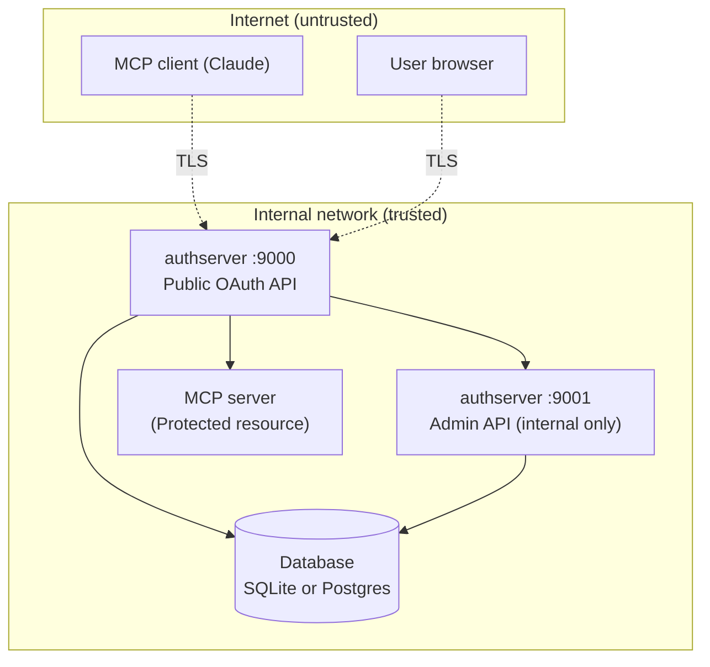

# Threat model

*Context: this is part of [Concepts](README.md). Start with the primer if you haven't.*

**For:** Architects, security reviewers, and operators preparing to deploy
authserver in production.

You want to understand: what attacks does it protect against, what are the
residual risks, and what should you monitor? This document walks through
each threat scenario, explains why it matters, and tells you what authserver
does about it.

## Trust boundaries

**Three trust boundaries matter:**

1. **Internet → TLS termination.** Everything outside your network is
   untrusted. TLS must terminate before authserver (via reverse proxy or
   load balancer).
2. **Public API → Admin API.** The admin port (`:9001`) must never be
   reachable from the internet. It's a separate listener specifically so
   you can firewall it.
3. **authserver → Database.** authserver trusts the database. If the
   database is compromised, all bets are off — but encrypted upstream
   tokens remain protected by the encryption layer.

---

## Threats and mitigations

### T1: Authorization code interception

**Scenario**: An attacker intercepts the authorization code as it travels from authserver to the client via the browser redirect. They try to exchange it for tokens before the legitimate client does.

**Why it fails**:
- **PKCE (S256 only)**: The code is useless without the code verifier, which never leaves the client. Even if the attacker grabs the code from the URL, they can't compute the verifier.
- **Single-use codes**: Atomic `UPDATE ... WHERE consumed_at IS NULL` — only the first exchange succeeds, even under concurrent requests.
- **10-minute expiry**: The window to attempt an attack is very small.
- **Exact redirect URI matching**: No wildcards, no prefix matching, no normalization tricks. The redirect goes exactly where it was registered.

**What to monitor**: `authplane_auth_code_exchange_total` with `result=failure` — a spike means someone is trying to replay codes.

### T2: Refresh token theft and replay

**Scenario**: An attacker steals a refresh token (from the client's storage, a log, or network intercept) and tries to use it to get new access tokens.

**Why it's contained**:
- **Rotation on every use**: Each refresh gives you a new token and invalidates the old one. The attacker and the legitimate client can't both succeed.
- **Reuse detection**: If a consumed refresh token is presented again, authserver revokes the **entire token family** — every refresh token in that chain becomes invalid. Both the attacker and the legitimate client lose access, forcing re-authentication. Already-issued access tokens are not reached: they live to `exp` (15 minutes by default; 1 hour for tokens exchanged from them) — see [what gets revoked when](../guides/operate/token-design-internals.md#what-gets-revoked-when).
- **Hashed storage**: Refresh tokens are stored as SHA-256 hashes. A database breach doesn't expose raw tokens.

**What to monitor**: the audit log for `action=family.revoked` or `action=family.revocation_failed` — every detection writes exactly one of the two (the second means the family could not be revoked and is still live), both with `reuse_detection` in the detail. Any such event means someone replayed a consumed token. Investigate immediately. If `authserver_revocation_failures_total{path="reuse",half="family"}` fires, the detection happened but the family could not be revoked — it is still live (`half="jti"` alone means the family is dead and only its already-issued access tokens outlive detection, bounded by `exp`); follow the [incident runbook](../guides/operate/incident-runbook.md#incident-refresh-token-reuse-burst).

### T3: Client impersonation

**Scenario**: An attacker registers a client with a redirect URI that intercepts tokens, then tricks users into authorizing it.

**Why it fails**:
- **DCR modes**: In `admin_only` mode, only pre-registered clients exist. In `approved_redirects` mode, only URIs matching approved patterns are allowed.
- **Exact redirect URI matching**: At authorization time, the redirect URI must exactly match what was registered. No creative URL encoding or path traversal.
- **CIMD validation**: For URL-based client IDs, authserver fetches and validates the client metadata document.
- **Client suspension**: The admin API can immediately suspend any client.

**What to monitor**: DCR registration rate — `authplane_dcr_registrations_total`. A sudden spike means someone may be trying to register malicious clients.

### T4: Session hijacking

**Scenario**: An attacker steals the session cookie (via XSS, network sniffing, or physical access to the browser) and impersonates the user.

**Why it's hard**:
- **HMAC-signed cookies**: The session cookie is signed with the session secret. Forging a cookie requires the secret.
- **`HttpOnly`**: JavaScript can't read the cookie (blocks XSS-based theft).
- **`Secure` flag**: In production (non-localhost issuer), the cookie is only sent over HTTPS.
- **`SameSite=Lax`**: Keeps the session cookie off cross-site subrequests and off non-GET top-level navigations. Treat this as defense in depth, not as the CSRF control: a `SameSite=None` deployment gets nothing from it, and `POST /login` has no session cookie to protect in the first place. The form that does ride this cookie, `POST /consent`, carries a per-form CSRF token derived from it.

**What to configure**: Set `session.secret` to a strong random value (32+ bytes). Set `session.secure: true` in production. These are enforced by startup validation for non-localhost issuers.

### T5: Credential brute force

**Scenario**: An attacker hammers the login endpoint with password guesses.

**Why it's slow**:
- **Per-IP throughput limiting**: Every public endpoint sits behind a per-source-address
  request-rate limiter (`rate_limit.requests_per_second`, `rate_limit.burst`).
- **Account lockout**: After `auth_fail_max` failed logins (default: 10) within
  `auth_fail_window` (default: 10 minutes), the submitted identity is locked for
  `auth_lockout` (default: 15 minutes). The lockout is keyed on the identity together with
  the source address, and it gates `POST /login` only — a locked-out account never affects
  token issuance, discovery or JWKS, for that user or any other. A successful login clears
  accumulated failures.
- **bcrypt hashing**: Each password check takes ~100ms, making brute force computationally
  expensive. The lockout is checked before hashing, so blocked attempts cost nothing.

**What to monitor**: `auth.locked_out` events in the audit log.

**Behind a reverse proxy**: authserver reads the source address from the connection only —
`X-Forwarded-For` is never trusted, because a header any client can set would make every
per-address limit forgeable. Behind a proxy every request therefore presents the proxy's
address, and the lockout key degrades to identity-only. That still bounds password guessing
per account; what it cannot do is tell a targeted lockout attempt against one account apart
from that account's own failures. Resolving real client addresses would need explicit
opt-in trusted-proxy configuration, which authserver does not currently offer.

### T6: Open redirect

**Scenario**: An attacker crafts a URL like `/authorize?redirect_uri=https://evil.com/steal` to redirect the user (and their auth code) to a malicious site.

**Why it fails**:
- **Exact string match**: The redirect URI must be character-for-character identical to what was registered. `https://app.example.com/callback` won't match `https://app.example.com/callback/extra`.
- **Error page, not redirect**: When the redirect URI is invalid, authserver shows an error page instead of redirecting. This prevents the open redirect entirely.
- **Internal redirects validated**: The login page's `next` parameter is validated by `safeRedirect()` to prevent redirect-to-external-site attacks.

### T7: JWKS spoofing

**Scenario**: An attacker tricks your MCP server into fetching a fake JWKS (containing the attacker's public key), then forges JWTs signed with their private key.

**Why it fails**:
- **Static configuration**: MCP servers must be configured with authserver's issuer URL. They don't discover it dynamically from untrusted sources.
- **HTTPS in production**: The JWKS URL is derived from the issuer URL, which should be HTTPS.
- **Key ID matching**: JWTs include a `kid` claim that must match a key in the JWKS.

**Your responsibility**: Configure your MCP servers with the correct issuer URL over HTTPS. Don't accept JWKS URLs from user input or untrusted metadata.

### T8: Admin API abuse

**Scenario**: An attacker reaches the admin API and uses it to register malicious clients, disable users, or read audit logs.

**Why it fails** (when properly deployed):
- **Separate port**: The admin API runs on `:9001`, not `:9000`. You can firewall them independently.
- **API key required**: In production, every admin request needs a valid API key in the `Authorization: Bearer` header.
- **Audit logged**: Every admin action is recorded — you can trace what happened.

**Your responsibility**: Never expose port `:9001` to the internet. Use a strong API key (32+ random characters). Rotate it if it's ever exposed.

### T9: Signing key compromise

**Scenario**: An attacker obtains the private signing key. They can now forge valid JWTs and impersonate any user to any MCP server.

**Why it's contained**:
- **Restrictive file permissions**: Key files are written with minimal permissions.
- **Vault Transit option**: With Vault Transit, the private key **never leaves Vault** — authserver sends data to Vault for signing, and only gets back the signature.
- **Key rotation**: `authserver admin key rotate` generates a new key immediately. The old key stays in JWKS only for verification of existing tokens.
- **Short token expiry**: Even with a compromised key, forged tokens are only useful until you rotate and MCP servers refresh their JWKS cache.

**Incident response**: Run `authserver admin key rotate` immediately. Wait for MCP servers to refresh JWKS (default 5 minutes). All tokens signed with the old key expire within 15 minutes.

### T10: CIMD document tampering

**Scenario**: An attacker modifies a CIMD metadata document to register their redirect URI for a legitimate-looking client ID.

**Why it fails**:
- **HTTPS required**: In production, CIMD document URLs must use HTTPS.
- **Validation**: CIMD documents are validated for required fields and redirect URI consistency.
- **Caching**: Documents are cached — an attacker who temporarily controls the URL can't re-register after the TTL.

### T11: Stored upstream token theft

**Scenario**: An attacker gets database access and tries to read users' stored third-party tokens (GitHub, Google, Notion, Atlassian, Slack, Linear, or any other provider registered as a connector).

**Why it fails**:
- **Encryption at rest**: All upstream tokens are encrypted with AES-256-GCM (or Vault Transit). The raw token never appears in the database.
- **Per-purpose keys**: HKDF derives separate keys for each purpose from the master key. Database access alone doesn't give you the key.
- **Master key external**: The AES master key is loaded from an environment variable — it's not in the database.
- **Vault Transit option**: With Vault Transit, the plaintext token never touches authserver's memory — encryption and decryption happen inside Vault.

**What to monitor**: Database access patterns. If someone dumps your database, they get ciphertext. As a precaution, rotate your master key: point `data_encryption.aes_master.key_env` at a new env var holding the new key, set `data_encryption.aes_master.old_key_env` to the env var holding the previous key (the AS uses old as decrypt-only fallback during the rotation window), and run a one-off SQL script to re-encrypt `broker_grants.credential_data`; the in-place re-encrypt admin endpoint is on the roadmap.

### T12: Unauthorized upstream token vending

**Scenario**: A malicious MCP server (or client) tries to vend tokens for upstream providers they shouldn't access via token exchange with `resource=<provider>`.

**Why it fails**:
- **Authentication required**: Requires a valid subject token (proving user identity) AND client authentication (proving the server's identity).
- **Three-bound enforcement**: three checks gate every vend, spread across `Exchange`, `dispatchBroker` and `BrokerIssuer` — not all in the issuer:
  1. requested ⊆ `consent_grants.scopes` — the user must have consented for this agent on this resource (bound C). Enforced by `dispatchBroker`'s agent-attestation gate, which is the only place on this path that reads `consent_grants`. A fronted Mint→Broker exchange leaves dispatch before that gate, which is why the fronting link's `scope_map` stands in for it there.
  2. requested → upstream-mapped ⊆ `broker_grants.scopes_granted` — the user must have authorized the upstream for these scopes (bound E). This is the bound `BrokerIssuer` itself owns; it holds no consent-grant dependency.
  3. The acting client must satisfy the resource's `policy.exchange.allowed_client_ids` — empty allows any client. Enforced in dispatch before either of the above.
- **Per-vend refresh**: Each vend refreshes the upstream token rather than caching access tokens; revocation upstream propagates within one vend.
- **Actor token rejection**: Broker exchange rejects actor tokens — it's impersonation-only.
- **Audit trail**: Every issuance is recorded in the `issuances` table with the user, agent, resource, scopes, and `dpop_jkt` (forensics contract — see `the data model` §2.5).

### T13: Connect flow CSRF

**Scenario**: An attacker tricks a user into connecting their GitHub account to the attacker's application.

**Why it fails**:
- **HMAC-signed state**: The state parameter is signed with the session secret and includes a timestamp and return URL. Forging it requires the secret.
- **Short TTL**: State tokens expire quickly.
- **Return URL allowlist**: `allowed_return_urls` restricts where the callback can redirect.
- **Upstream PKCE**: The OAuth flow to the upstream provider (GitHub, etc.) also uses PKCE.

### T14: DPoP proof replay

**Scenario**: An attacker captures a DPoP proof JWT from a network request and replays it to use the associated DPoP-bound access token.

**Why it fails**:
- **JTI uniqueness**: Every DPoP proof must carry a unique `jti`. Duplicates return `ErrDPoPReplay`.
- **Database-backed replay prevention**: `DPoPNonceStore.ConsumeJTI()` atomically checks and records each `jti`.
- **Server-issued nonce**: When `require_nonce: true`, each proof must include a fresh nonce from the server, binding it to a narrow time window.
- **`iat` freshness**: Proofs with timestamps outside the `proof_lifetime` window (default: 2 minutes) are rejected.

**What to monitor**: `authplane_dpop_proofs_rejected_total` with `reason=replay` — any non-zero value means someone is replaying proofs.

### T15: DPoP algorithm confusion

**Scenario**: An attacker submits a DPoP proof with `alg:none` or an HMAC algorithm, tricking the server into accepting an unsigned or self-signed proof.

**Why it fails**:
- **Strict allowlist**: Only ES256, RS256, and PS256 are accepted.
- **`alg:none` unconditionally rejected**: Before any other validation.
- **All HMAC algorithms rejected**: `HS256`, `HS384`, `HS512` — all blocked.
- **Private key in `jwk` header rejected**: Only public keys are accepted in the proof's `jwk` header.

### T16: Token exchange privilege escalation

**Scenario**: A client uses token exchange to get a token with broader scopes than the original subject token had.

**Why it fails**:
- **Scope subset enforcement**: The exchanged token's scope must be ≤ the subject token's scope.
- **Chain depth limit**: `max_chain_depth` prevents unbounded delegation.
- **Self-exchange blocked** (by default): A client can't exchange its own token back to itself unless `allow_self_exchange` is explicitly enabled.
- **Acting-client authorization**: A client exchanging a token issued to a *different* client must be named in the target resource's `policy.exchange.allowed_client_ids`, or in its `policy.runtime.client_ids` (which declares the caller *is* that resource). Without a `resource` parameter there is no gate that can authorize a cross-client exchange, so it is refused.

### T17: Cross-client unauthorized exchange

**Scenario**: An attacker registers an MCP server client and tries to exchange tokens belonging to users of a different application.

**Why it fails**:
- **Per-resource exchange policy**: Each Mint or Broker resource carries `policy.exchange.allowed_client_ids` — only clients in that list may act for that resource. An empty list is permissive, but only for a client exchanging a token issued to itself; a client presenting a token minted for a *different* client must, on the direct Mint path, be named either in that list or in the resource's `policy.runtime.client_ids` — the latter declaring that the caller *is* the resource, so the token's holder and its audience coincide and no third party is being delegated to. That asymmetry is the whole of this scenario's defense: the exchange is authorized by a `consent_grants` row keyed on the subject token's client, so without the allowlist entry the attacker's client would spend a grant belonging to the victim's application. Fronted paths are excluded because they read no consent row at all — the operator's fronting link is itself the explicit declaration.
- **The acting client is gated**: the per-resource policy is matched against the requesting client's `client_id` (who's asking for the exchange). The subject token's `client_id` (the app the token was issued to) is *not* matched against the allowlist — it is the lookup key for the consent grant below, so it constrains which consent row must exist rather than who may act. Keying consent on the subject token's client is deliberate and is what makes a delegation chain expressible at all: a downstream agent never faces the user, so it can only inherit the grant its caller holds. The operator allowlist is where that inheritance is authorized.
- **Consent** still applies: even an allowed client must have a `consent_grants` row for the (user, agent, resource) tuple covering the requested scopes — except a Mint self-exchange (`allow_self_exchange: true`, same `client_id`) or a fronted exchange, which skip this gate. Fronting skips it on both target kinds: on Mint→Mint the link stands in for the consent row, and on Mint→Broker dispatch hands off to the fronted-broker path before the agent-attestation lookup, so no `consent_grants` row is consulted there either. Neither is unbounded: every requested target scope must appear in the fronting link's `scope_map` and the subject token must already cover the source side of that mapping — and a Broker vend still has to fit inside the upstream `broker_grants` ceiling. The two paths do not derive that source-side requirement the same way, and the difference is only visible on a `scope_map` where several source keys point at one target: Mint→Broker (`validateBrokerTargets`) clears the target if the subject carries **any** of them, while Mint→Mint (`requiredSourceScopesForTargets`) requires the lexicographically first one specifically. So `{"a": ["t"], "b": ["t"]}` with a `b`-only subject token reaches `t` through a Broker target and is denied `invalid_scope` through a Mint one. Single-source maps — the common shape — behave identically.
- **Audit trail**: every exchange writes an `issuances` row carrying the acting `client_id` (on a fronted exchange, the source resource's slug), the subject user, the resource and the granted scopes. The row has a single `client_id` column — the subject token's own `client_id` is not persisted there; delegation is reconstructed from `agent_id` + `agent_chain` and the token's `act` claim.

### T18: Machine token abuse

**Scenario**: A compromised backend service uses the client credentials grant to mint machine tokens and access MCP tools.

**Why it's contained**:
- **Grant type enforcement**: Only clients explicitly registered with `grant_types: [client_credentials]` can use this flow.
- **Confidential clients only**: Public clients (no secret) can't request machine tokens.
- **No refresh tokens**: Machine tokens expire and can't be renewed without the client secret. If you rotate the secret, the old service stops working.
- **Individual revocation**: Machine tokens are stored by JTI and can be revoked individually.
- **Short expiry**: Default 1 hour. Even without revocation, a stolen token is time-limited.

**Incident response**: Suspend the client via `PATCH /admin/clients/{id}/suspend`. Revoke active tokens via `POST /oauth/revoke`. Register a new client with a fresh secret.

---

### T19: Using the authorization server as an outbound fetch amplifier

**Scenario**: `GET /oauth/authorize` takes no session, and a URL-shaped
`client_id` is resolved by fetching that URL. An attacker points it at a third
party — `client_id=https://victim.example.com/x.json` — and repeats, turning
unauthenticated requests into outbound traffic from your server: a reflected
denial of service aimed at the victim, and memory and sockets spent on yours.

**Why it's contained**:
- **Negative cache**: A target that fails is not re-fetched for 30 seconds.
  Measured before this existed, 50 inbound requests produced 50 outbound ones;
  they now produce one.
- **Single-flight**: Concurrent requests naming the same URL share one outbound
  fetch rather than each making their own.
- **Global in-flight limit**: At most 16 CIMD fetches run at once, whatever the
  inbound rate. This is what bounds the memory held in read buffers (up to 1 MB
  per fetch) and the bandwidth aimed at any one third party. The cap is per
  process, like the rate limiter and the lockout tracker, so an N-replica
  deployment allows N × 16 concurrent fetches.
- **SSRF-safe transport**: With `cimd.allow_private_addresses` off (the
  default), every resolved address is checked before the dial, so private and
  link-local targets are refused. `cimd.require_https` does not govern this —
  it checks the URL's scheme and nothing else.

**What this does not do**: it bounds the cost, it does not require
authorization. A caller who has never logged in can still cause *some* outbound
request to a host they choose — one per URL per 30 seconds, within a global cap
of 16 concurrent. If that is unacceptable in your deployment, set
`dcr.mode: admin_only`, which stops URL-shaped `client_id`s from resolving at
all, or turn CIMD off with `cimd.enabled: false`.

**What to monitor**: `authserver_cimd_fetch_suppressed_total`. A sustained rate
means someone is driving fetches, not that clients are registering.

---

## What to monitor in production

These are the signals that tell you something might be wrong:

| Signal | Metric / Log | What it means |
|--------|-------------|---------------|
| Refresh token reuse | Audit log: `action=family.revoked` (detail carries `reuse_detection`) | Someone replayed a consumed token. Possible theft. |
| Auth failures spike | Audit log: `action=user.login_failed` | Brute force attempt or credential stuffing. |
| Account lockout engaged | Audit log: `action=auth.locked_out` (detail carries `email` and `until`) | An identity crossed `auth_fail_max`. One event per lockout, not per blocked request. |
| DPoP replay attempts | `authplane_dpop_proofs_rejected_total{reason=replay}` | Someone is replaying captured DPoP proofs. |
| Token exchange denials | `authplane_token_exchange_denied_total` | Unauthorized exchange attempts. Check the `reason` label. |
| Machine token denials | `authplane_client_credentials_denied_total` | Clients trying grants they're not authorized for. |
| Admin API audit events | Audit log: `action=client_registered`, `client_suspended`, etc. | Track all administrative changes. |
| CIMD fetches being driven | `authserver_cimd_fetch_suppressed_total` | Someone is pointing `/oauth/authorize` at URLs of their choosing. `reason=capacity` means the global in-flight limit is saturating. |

---

## Incident response playbook

### Token theft (access or refresh)

1. **Revoke**: `POST /oauth/revoke` with the token (or the client's ID if you don't have the token).
2. **Check audit log**: `GET /admin/audit?client_id=<affected_client>` to see what the token was used for.
3. **If refresh token was stolen**: The family is already revoked by reuse detection. Force re-authentication.
4. **Consider DPoP**: If tokens are being stolen in transit, enable DPoP to bind tokens to client key pairs.

### Signing key compromise

1. **Rotate immediately**: `authserver admin key rotate`
2. **Wait for JWKS propagation**: MCP servers refresh JWKS every 5 minutes by default.
3. **All existing access tokens** expire within 15 minutes (default expiry).
4. **Refresh tokens** continue to work (they're not JWTs — they're verified by database lookup).
5. **Review**: Check if the attacker forged any tokens by correlating `jti` values with the token store.

### Admin API key leak

1. **Rotate the API key**: Update `AUTHPLANE_ADMIN_API_KEY` and restart authserver.
2. **Review audit log**: Check what the attacker did with admin access.
3. **Suspend any clients** created by the attacker.
4. **Verify**: Check that no users were disabled or modified.

### Database breach

1. **Vault tokens are encrypted**: The attacker gets ciphertext, not raw tokens. But still:
2. **Rotate master key**: point `data_encryption.aes_master.key_env` at a new env var holding the new key, and `data_encryption.aes_master.old_key_env` at the env var holding the previous key (decrypt-only fallback). Re-encrypt `broker_grants.credential_data` with a one-off SQL script — the in-place re-encrypt admin endpoint is on the roadmap.
3. **Rotate signing key**: `authserver admin key rotate` — assume the old key is compromised.
4. **Reset all user passwords**: Via admin API.
5. **Revoke all client secrets**: Register new clients with fresh secrets.

---

## Known limitations

These are things authserver doesn't protect against. They're design decisions, not bugs.

| Limitation | Why it exists | What you can do |
|-----------|--------------|-----------------|
| **Single signing key per instance** | Simplicity. Multi-region deployments need shared keys. | Use Vault Transit or `postgres_key` store for HA deployments. |
| **No client authentication for public clients** | MCP clients (Claude Code, Claude Desktop) can't keep secrets. MCP spec requires public clients. | Security relies on PKCE + refresh token rotation. This is standard OAuth 2.1 practice. |
| **In-memory rate limiting** | Counters reset on restart and aren't shared across instances. | Use an external rate limiter (load balancer, API gateway) for multi-instance deployments. |
| **Account lockout is per process** | Lockout counters live in memory, so each replica keeps its own. An N-replica deployment gives a password guesser roughly N× the failure budget before any lockout engages, and a restart clears the state. | Run a single replica where account lockout is a load-bearing control, or enforce it at a shared component in front. |
| **Account lockout is evadable from many source addresses** | The lockout key is the identity *and* the source address. Exposed directly to the internet, an attacker with N addresses gets N × `auth_fail_max` guesses against one account and never trips a lockout. Behind a reverse proxy the address component is constant, so the key collapses to identity-only and the lockout does bound guessing per account — the two deployments differ here. The previous IP-only key was equally evadable, so this is a property of account lockout, not a regression. | Rely on per-address throughput limiting and bcrypt for the distributed case; treat account lockout as protection against a single noisy source, not a global guess budget. |
| **Lockout tracking is bounded** | The lockout map is keyed partly on the submitted email address, so its key space is caller-chosen and cheap to fill — roughly four source addresses, each inside the per-address rate limit, hold it at `rate_limit.max_tracked_identities` (default 250000) indefinitely. At the bound the server evicts an entry that is *not* currently locked rather than refusing the newcomer, so a flood cannot leave an untouched account unprotected; lockouts already in force are never evicted. What a sustained flood can do is reset an account's partial failure count, which costs the attacker a full refill of the map each time. | Raise the bound alongside `auth_fail_window`, which scales the live set linearly. Two distinct warnings: "…at capacity — evicting unlocked entries" means the map is full and absorbing a flood normally; "…at capacity with every identity locked — refusing" means the control turned a newcomer away. Alert on the second. |
| **Failed logins write audit rows the attacker sizes** | Two events on the login path persist a row carrying the submitted address, up to 254 bytes of caller-chosen text, and the key space is caller-chosen so invented addresses work. `user.login_failed` is written on **every** failed attempt, including addresses that match no account — that is deliberate, because suppressing it for unknown users is what left an enumeration sweep with no durable trail, and the constant-time login means the response cannot tell the two apart anyway. `auth.locked_out` adds one more row per ten failures. At the per-address rate limit that is roughly 8.6M rows a day per source address. The cost is not only storage: `AuditService.Record` writes synchronously on the request goroutine and then logs the event at INFO with the address in `detail`, so each probe also buys a blocking insert and a second log line on top of the WARN the denial already emits — it compounds with the bcrypt CPU in the row above. `authserver purge` does not cover `audit_events` — it purges tokens, revocations, nonces and JTIs — so the growth is permanent unless you prune the table yourself. | Size the audit store for it and schedule your own retention on `audit_events`. Do not suppress the unknown-address rows to control the volume: that is the trail an enumeration attempt leaves, and `reason=user_not_found` is what makes it separable from ordinary mistyped passwords. Per-address throughput limiting on `POST /login` is what bounds the rate. |
| **A failed login costs a full bcrypt derivation** | Every rejected login runs one bcrypt comparison at `DefaultBcryptCost`, about 200ms of CPU, including for addresses that match no account. That uniformity is deliberate — returning early is what made the login page a user-enumeration oracle — but it means an unauthenticated request can spend server CPU. Account lockout does not bound it: the key is the submitted identity, so an attacker who never repeats an address is never a locked identity, and the lockout gate sits ahead of bcrypt precisely so *blocked* attempts stay free. Throughput limiting is the only control, and the default is not sized for a 200ms handler: `rate_limit.requests_per_second` is 100, and `ClientIP` keys on `RemoteAddr` ignoring `X-Forwarded-For`, so behind a reverse proxy every caller shares one bucket — roughly 20 seconds of bcrypt CPU per second of wall clock. | Lower `rate_limit.requests_per_second`, or put a tighter login-specific limit on `POST /login` at your gateway, sized against the cores you are willing to give the login path. Do not try to fix it by returning early for unknown addresses; that reinstates the enumeration oracle. |
| **No mTLS termination** | authserver doesn't terminate TLS — it's designed to run behind a reverse proxy. | Put Caddy, nginx, or a load balancer in front with proper TLS configuration. |
| **JWT revocation is not instant** | JWTs are verified locally by MCP servers. A revoked JWT remains valid until it expires or the MCP server checks introspection. | Keep token expiry short (15 minutes default). Use the introspection endpoint for real-time revocation checks. |

---

## Security contacts

Report security vulnerabilities to the project maintainers via the private disclosure process described in `SECURITY.md` at the repository root.

## Where to go next

- [Tokens and claims](tokens-and-claims.md) — the token shape each threat
  applies to.
- [DPoP and proof of possession](dpop-and-proof-of-possession.md) — the
  primary defense against token theft (T2, T14, T15).
- [Key rotation guide](../guides/operate/key-rotation.md) — the
  operational counterpart to T9.
- [Observability with Prometheus and OTel](../guides/deploy/observability-prometheus-otel.md) — how
  to wire up the metrics this page references.
