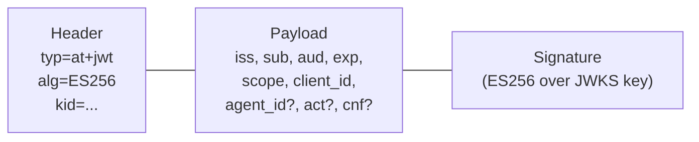

# Tokens and claims

*Context: this is part of [Concepts](README.md). Start with the primer if you haven't.*

You're building an MCP server, integrating with authserver, or just want to
understand what tokens authserver issues, how they're structured, and the
security reasoning behind each design choice.

This page covers the wire shape and claim semantics. For the lifecycle and
threat surface, jump to [Threat model](threat-model.md).

## Anatomy of an access token



A token is a [JWT](glossary.md#glossary-jwt) (RFC 9068 `at+jwt`) carrying
three groups of claims: who issued it (`iss`), who/what it represents
(`sub`/`client_id`/`agent_id`), and what it grants (`aud`/`scope`/`exp`).

---

## The five token types at a glance

| Token | Format | Lifetime | What it's for |
|-------|--------|----------|---------------|
| **Access token** | JWT (`at+jwt`) | 15 min | MCP server authorization — "this user can use mcp:echo" |
| **Refresh token** | Opaque (random string) | 7 days | Get new access tokens without re-authenticating |
| **Machine token** | JWT (`at+jwt`) | 1 hour | Service-to-service calls — no user involved |
| **Exchanged token** | JWT (`at+jwt`) | 15 min–1 hour | Agent delegation — "Agent A is acting on behalf of User X" |
| **Auth code** | Opaque (random string) | 10 min | One-time code exchanged for tokens during login |

---

## Access tokens (JWT)

[Access tokens](glossary.md#glossary-access-token) are the primary credential
your MCP server sees. They're JWTs following
[RFC 9068](https://datatracker.ietf.org/doc/html/rfc9068).

### What's inside

```json
{
  "typ": "at+jwt",
  "alg": "ES256",
  "kid": "key-2026-02"
}
```

```json
{
  "iss": "http://localhost:9000",
  "sub": "user-uuid-v7",
  "aud": ["http://mcp-server:3000/mcp"],
  "exp": 1708762500,
  "iat": 1708761600,
  "jti": "token-uuid-v7",
  "client_id": "client-uuid-v7",
  "scope": "mcp:echo mcp:query_database"
}
```

### What each claim means for your MCP server

| Claim | What it tells you | What to do with it |
|-------|-------------------|-------------------|
| `iss` | Who issued this token (authserver's URL) | Verify it matches your configured issuer |
| `sub` | The user's ID | Use for per-user access control and audit trails |
| `aud` | Which MCP server this token is for | Reject if your server's URI isn't in the list |
| `exp` | When the token expires (Unix timestamp) | Reject expired tokens |
| `jti` | Unique token ID (UUID v7, monotonic) | Use for logging and correlation |
| `client_id` | Which OAuth client requested this token | Use for per-client rate limiting or access control |
| `scope` | Space-separated list of granted tools | Check before executing any tool |

### How to verify an access token

Your MCP server verifies tokens locally — no network call to authserver per
request:

1. Fetch authserver's [JWKS](glossary.md#glossary-jwks) from
   `/.well-known/jwks.json` (cache it, refresh every 5 minutes).
2. Match the JWT's `kid` header to a key in the JWKS.
3. Verify the signature using that key.
4. Check `iss` matches your configured issuer.
5. Check [`aud`](glossary.md#glossary-audience) includes your MCP server's
   URI.
6. Check `exp` is in the future.

This is the key advantage of JWT access tokens: your MCP server doesn't need
to call authserver for every request. The official SDKs ship a
[token verifier](glossary.md#glossary-token-verifier) that does all six
checks.

### Why 15 minutes?

Short expiry is the primary defense against token theft for bearer tokens. If
someone steals an access token, it's only useful for 15 minutes. For stronger
protection, enable [DPoP](dpop-and-proof-of-possession.md) which binds tokens
to a key pair — a stolen token is useless without the private key.

---

## Refresh tokens (opaque)

[Refresh tokens](glossary.md#glossary-refresh-token) are cryptographically
random strings — not JWTs. They're used to get new access tokens without
making the user log in again.

### Why opaque instead of JWT?

Refresh tokens are:
- **Long-lived** (7 days) — too long for an unrevocable JWT
- **Stateful** — rotation requires server-side tracking
- **Instantly revocable** — family-wide revocation must work immediately

JWTs would be the wrong choice because they'd remain valid until expiry even after revocation.

### Token families and rotation

Every login creates a "token family." When the client refreshes:

1. The current refresh token is consumed (marked as used)
2. A new refresh token is created in the same family
3. The client gets a new access token + new refresh token

**If someone replays a consumed refresh token** (indicating possible theft):
- The **entire family is revoked** — every refresh token in the chain becomes invalid
- Both the attacker and the legitimate client lose access
- The user must re-authenticate
- `authserver_refresh_token_reuse_total` fires
- Access tokens already issued from the family are not reached: they live to `exp` (15 min by default; 1 hour for tokens exchanged from them) — see [what gets revoked when](../guides/operate/token-design-internals.md#what-gets-revoked-when)

This is the OAuth 2.1 required pattern for refresh token rotation with reuse detection.

### Storage

Refresh tokens are stored as SHA-256 hashes. The raw token is returned to the client once and never stored. Even a full database dump doesn't expose raw refresh tokens.

---

## Machine tokens (client credentials)

Machine tokens are for backend services that need to call MCP tools as
themselves — no user involved. They're issued via the
[client credentials grant](glossary.md#glossary-client-credentials-grant).

### What's different from user access tokens

```json
{
  "iss": "http://localhost:9000",
  "sub": "client-uuid-v7",
  "aud": ["http://mcp-server:3000/mcp"],
  "exp": 1708762500,
  "iat": 1708761600,
  "jti": "machine-token-uuid-v7",
  "client_id": "client-uuid-v7",
  "scope": "mcp:query_database"
}
```

**`sub` equals `client_id`**: There's no user. The service itself is the subject. Your MCP server can use this to distinguish machine requests from user requests — if `sub == client_id`, it's a machine token.

**No refresh token**: Machine clients re-authenticate (with their client secret) to get new tokens. No rotation complexity, and a stolen token is only valid until expiry.

**Stored by JTI**: Each machine token is recorded in the database, enabling individual revocation via `POST /oauth/revoke`.

### Why no refresh token for machines?

Machine clients can re-authenticate instantly — they have the secret and don't need human interaction. Refresh tokens would add complexity and risk (a stolen refresh token grants ongoing access) with no UX benefit.

---

## DPoP-bound tokens

[DPoP](glossary.md#glossary-dpop) (Demonstrating Proof-of-Possession,
[RFC 9449](https://datatracker.ietf.org/doc/html/rfc9449)) adds a layer on
top of regular access tokens. A DPoP-bound token is useless without the
client's private key. See
[DPoP and proof of possession](dpop-and-proof-of-possession.md) for the full
treatment.

### What changes in the token

A DPoP-bound token includes a `cnf` (confirmation) claim:

```json
{
  "iss": "http://localhost:9000",
  "sub": "user-uuid-v7",
  "scope": "mcp:echo",
  "cnf": {
    "jkt": "0ZcOCORZNYy-DWpqq30jZyJGHTN0d2HglBV3uiguA4I"
  }
}
```

The `jkt` is a thumbprint of the client's public key. The token response uses `token_type: DPoP` instead of `Bearer`.

### How it protects against theft

Without DPoP: steal the token → use it.
With DPoP: steal the token → useless without the private key.

Every request must include a DPoP proof JWT signed by the same key pair. The MCP server checks that the proof's public key thumbprint matches the `cnf.jkt` in the token.

### Algorithm restrictions

Only asymmetric algorithms are allowed for DPoP proofs: ES256, RS256, PS256. These are unconditionally rejected:
- `alg:none`
- All HMAC algorithms (`HS256`, `HS384`, `HS512`)
- Private key material in the `jwk` header

---

## Exchanged tokens (RFC 8693)

[Token exchange](glossary.md#glossary-token-exchange) allows one client to
get a new token based on an existing one. Used for agent delegation and
upstream-provider vending. See
[Delegation and agent chains](delegation-and-agent-chains.md) for the
narrative; this section covers the claim shape only.

### The `act` claim

When an MCP server exchanges a user's token, the resulting token carries an
[`act`](glossary.md#glossary-act-claim) (actor) claim recording who
performed the exchange:

```json
{
  "iss": "http://localhost:9000",
  "sub": "user-uuid-v7",
  "scope": "mcp:query_database",
  "act": {
    "sub": "mcp-server-client-id",
    "actor_type": "service"
  }
}
```

This tells downstream services: "This token belongs to user X, but MCP server Y is the one acting." The `actor_type` field distinguishes AI agents (`"agent"`) from conventional services (`"service"`); it is derived from the acting client's `is_agent` flag.

### Multi-hop delegation

Each successive exchange nests the previous actor. authserver stamps `actor_type` on the new outermost hop only; inner hops pass through unchanged:

```json
{
  "sub": "user-uuid-v7",
  "act": {
    "sub": "agent-b-client-id",
    "actor_type": "agent",
    "act": {
      "sub": "agent-a-client-id",
      "actor_type": "agent"
    }
  }
}
```

The outermost `act` is the most recent actor. Deeper nesting represents earlier actors. The chain depth is capped by `max_chain_depth` — exceeding it returns `ErrTokenExchangeChainTooDeep`.

Per RFC 8693 §4.1 ¶1, each hop is a JSON object of identifying claims and other members may appear (`client_id`, `iss`, custom fields). authserver preserves them losslessly across a round-trip. Non-identity JWT structural claims (`exp`, `nbf`, `aud`, `iat`, `jti`) are never stamped inside an `act` hop per §4.1 ¶2.

> **RFC 8693 §4.1 ¶6 — only the outermost actor is authoritative.** Resource servers MUST use only the token's top-level claims and the current (outermost) actor for access-control decisions. Inner-hop metadata — including inner `actor_type` — is informational only and MUST NOT influence authorization.

### Scope enforcement

The exchanged token's scope must be ≤ the subject token's scope. A client cannot escalate privileges through exchange.

### Vault vend via exchange

When `resource=<service>` is included in the exchange request and matches a configured broker provider, authserver returns the user's stored third-party token (e.g., their GitHub token) instead of an authserver JWT. The response still follows the RFC 8693 format.

---

## Agent identity claims

These are optional claims that track AI agent identities through multi-hop workflows.

```json
{
  "sub": "user-uuid-v7",
  "agent_id": "claude-agent-abc123",
  "agent_chain": [
    "orchestrator-agent-001",
    "planning-agent-002",
    "claude-agent-abc123"
  ]
}
```

**[`agent_id`](glossary.md#glossary-agent-id)**: Identifies the specific
agent instance.
**[`agent_chain`](glossary.md#glossary-agent-chain)**: Ordered list of
agents in the workflow (first = originator, last = current).

Capped at 8 entries. Additive only — previous entries can't be modified.
Fully optional — tokens without agent info omit these claims entirely. See
[Delegation and agent chains](delegation-and-agent-chains.md) for the full
treatment.

---

## Auth codes

Auth codes are the short-lived, one-time credentials used during the login flow.

- **256 bits of randomness** — cryptographically secure
- **Stored as SHA-256 hashes** — database breach doesn't expose raw codes
- **Single-use**: Atomic `UPDATE ... WHERE consumed_at IS NULL RETURNING *` — only one exchange succeeds, even under concurrent requests
- **10-minute expiry** — very short attack window
- **Bound to**: `client_id`, `redirect_uri`, `code_challenge`, `scope`, `resource`

---

## Token lifecycle at a glance

### Authorization code flow

```
User logs in → auth code (10 min, single-use)
  → exchange → access_token (15 min) + refresh_token (7 days)
  → access_token expires → refresh → new access_token + new refresh_token
  → repeat until refresh_token expires → user logs in again
```

### With DPoP

Same as above, but the client includes a DPoP proof at the token endpoint. The access token gets a `cnf.jkt` claim and `token_type: DPoP`. Every subsequent request requires a fresh DPoP proof.

### Client credentials

```
Service authenticates (client_id + client_secret) → machine token (1 hour)
  → token expires → service re-authenticates
```

### Token exchange

```
Client presents subject_token + grant_type=token-exchange
  → server validates subject_token, checks authorization
  → exchanged token with act claim (scope ≤ subject_token scope)
```

### Revocation

- `POST /oauth/revoke` with any token → family revoked (for refresh tokens)
- Admin revokes client → all families revoked
- Refresh token replayed → entire family revoked (theft detection)
- Machine token → revoked individually by JTI

---

## Why JWT for access tokens and opaque for refresh tokens?

This is the most important design decision in the token system.

**JWT access tokens** enable offline verification. Your MCP server fetches JWKS once, then verifies every token locally. No per-request network call to authserver. This is critical when you have multiple MCP servers deployed independently.

The tradeoff: JWT tokens can't be instantly revoked (the MCP server uses its cached JWKS and doesn't check revocation). This is mitigated by:
- Short expiry (15 minutes)
- The introspection endpoint for servers that need real-time revocation checks

**Opaque refresh tokens** must be stateful because:
- They need rotation (server tracks which one is current)
- They need instant [revocation](glossary.md#glossary-revocation) (family-wide)
- They're long-lived (7 days) — too long to trust without server-side state

---

## Security properties comparison

| Property | Access token | DPoP access token | Machine token | Exchanged token | Refresh token | Auth code |
|----------|-------------|-------------------|--------------|-----------------|--------------|-----------|
| Format | JWT | JWT | JWT | JWT | Opaque | Opaque |
| Stored server-side | No | No | By JTI | No | SHA-256 hash | SHA-256 hash |
| Default lifetime | 15 min | 15 min | 1 hour | 15 min–1 hour | 7 days | 10 min |
| Rotated on use | No | No | No | No | Yes | N/A (single-use) |
| Instantly revocable | No (expires) | No (expires) | Yes (DB by JTI) | No (expires) | Yes (DB) | N/A |
| Theft protection | Short expiry only | DPoP binding (cnf.jkt) | Short expiry only | Short expiry only | Family reuse detection | PKCE |
| Audience bound | Yes (`aud`) | Yes (`aud`) | Yes (`aud`) | Yes (`aud`) | Via family | Via session |
| Delegation chain | No | No | No | Yes (`act` claim) | No | No |

## Where to go next

- [DPoP and proof of possession](dpop-and-proof-of-possession.md) — how
  sender-constrained tokens work.
- [Delegation and agent chains](delegation-and-agent-chains.md) — what
  `act` / `agent_chain` mean in practice.
- [HTTP API reference](../reference/http-api.md) — the wire shape of every
  endpoint.
