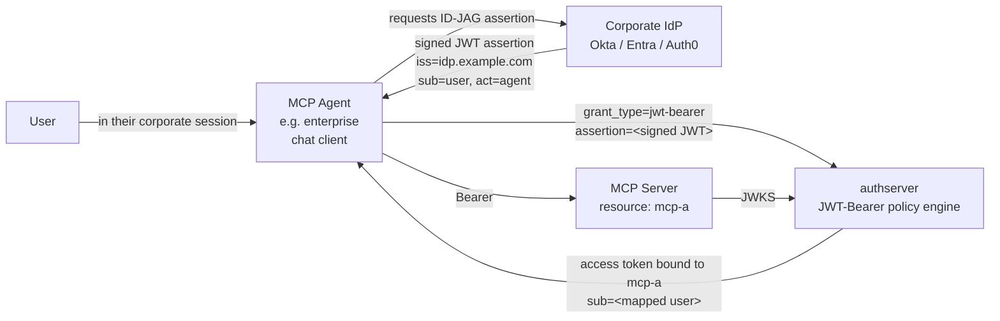
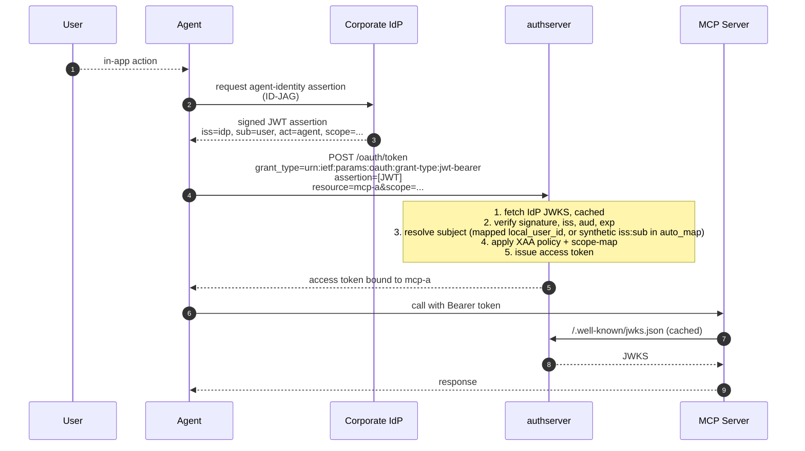

# Enterprise-Asserted Agent Identity (XAA)

*Context: part of [Topologies](README.md). Start with the decision tree if you haven't.*

> **At a glance.** A corporate IdP signs an assertion (ID-JAG) declaring
> "this [agent](../concepts/glossary.md#glossary-agent) acts for this
> user under this policy" — the
> [XAA](../concepts/glossary.md#glossary-xaa) pattern. The agent
> presents the assertion at authserver via the
> [JWT-Bearer grant](../concepts/glossary.md#glossary-jwt-bearer)
> (RFC 7523). authserver verifies the signature against the IdP's
> [JWKS](../concepts/glossary.md#glossary-jwks), applies a
> policy-engine subject mapping, and issues a normal
> [access token](../concepts/glossary.md#glossary-access-token).
> Per-user audit anchored on a corporate-IdP-signed assertion. Shipped
> at v0.1.x.

## Topology



The components:

- **Corporate IdP** — owns the agent-identity assertion. The
  assertion's signature is the trust anchor.
- **Agent** — does **not** run the user-redirect auth-code flow.
  Instead it asks the IdP for an assertion and presents it directly to
  authserver.
- **authserver** — the
  [Authorization Server](../concepts/glossary.md#glossary-authorization-server)
  exposes the JWT-Bearer (RFC 7523) grant. Verifies the assertion's
  signature, runs the configured XAA policy (subject-mapping +
  [scope](../concepts/glossary.md#glossary-scope)-mapping rules),
  issues an ordinary access token.
- **MCP server** — the
  [Resource Server](../concepts/glossary.md#glossary-resource-server)
  receives an ordinary AS-issued
  [JWT](../concepts/glossary.md#glossary-jwt). It does not need to
  know XAA happened.

## Flow



There is no browser hop and no consent screen — the IdP-signed
assertion is the consent. authserver's role is to verify and translate.

## When to use

- An enterprise has a corporate IdP that can mint per-agent identity
  assertions (Okta, Entra ID Conditional Access, Auth0 with MFA gating
  the IdP session).
- Agents run inside a managed corporate session and shouldn't bounce
  the user through a consent screen for every MCP call.
- Compliance requires that the agent-identity trust anchor be the
  corporate IdP, not a per-MCP user click.

**Don't use when:**

- You only need to federate **human** login → use
  [oidc-federated-login.md](oidc-federated-login.md). XAA is for the
  agent-identity link, not human login.
- The agent is a generic public client where per-MCP user consent is
  the right granularity → [single-mcp.md](single-mcp.md).
- You don't have an IdP that can mint ID-JAG assertions yet — XAA
  requires the IdP-side flow be implemented first.

## How to configure

> **Mixed-mode topology.** XAA splits its config across two layers:
>
> - **Policy knobs** live in YAML under `xaa:` — token expiry,
>   assertion-age window, subject mode, JWKS cache TTL. Boot-time
>   only; there is no Admin UI / CLI / REST surface for these.
> - **The trusted-IdP registry and subject-mapping rules** live in
>   **DB tables** — `trusted_idps` (one row per accepted issuer) and
>   `subject_mappings` (issuer-subject → local-user mapping rules).
>   These are managed via admin endpoints, not YAML.
> - **The Resource registration** that the issued token targets is
>   the ordinary [single-mcp.md](single-mcp.md) shape and is
>   available in all three modes.

Full per-IdP setup recipes are in
[enterprise-managed-auth-xaa.md](../guides/federation/enterprise-managed-auth-xaa.md).

### Policy YAML — every key matches `XAAConfig` in `internal/config/config.go`

```yaml
xaa:
  enabled: true
  token_expiry: 1h          # TTL for XAA-issued access tokens
  max_assertion_age: 5m     # Reject ID-JAGs whose iat is older than this
  require_resource: false   # If true, the exchange must name a resource
  subject_mode: auto_map    # "auto_map" or "strict"
  jwks_cache_ttl: 1h
```

### Trusted-IdP and subject-mapping rules

These are **not** in YAML. The `trusted_idps` and `subject_mappings`
tables are populated via the admin endpoints documented in
[enterprise-managed-auth-xaa.md](../guides/federation/enterprise-managed-auth-xaa.md) and the
related Linear issues. Schema sketch:

```sql
trusted_idps      (id, issuer, jwks_uri, audience, enabled, …)
subject_mappings  (id, idp_id, idp_subject, local_user_id, …)
```

After XAA is enabled in YAML and trusted IdPs are registered:

1. **Register the MCP** as an ordinary Mint Resource — UI / CLI / REST
   shape from [single-mcp.md](single-mcp.md).
2. **Test against the public reproduction harness** —
   [xaa-with-okta.md](../guides/federation/xaa-with-okta.md) walks
   through end-to-end XAA validation against Okta's public playground
   without needing an Okta tenant.

## How authserver handles it

| Step | AS-side action |
|---|---|
| Receive `grant_type=urn:ietf:params:oauth:grant-type:jwt-bearer` | Routes to `JWTBearerService` in `internal/services/jwt_bearer.go`. |
| Verify assertion signature | Looks up the issuer in `trusted_idps`. Fetches the IdP's JWKS (cached per `xaa.jwks_cache_ttl`); verifies `iss`, `aud`, `exp`, signature; rejects assertions whose `iat` is older than `xaa.max_assertion_age`. |
| Resolve subject | Looks up `subject_mappings(idp_id, idp_subject)`. Hit with `local_user_id` set → use that local user. Hit with `local_user_id` empty, or miss + `xaa.subject_mode=auto_map` → use the synthetic identity `<idp_issuer>:<idp_subject>` as the subject (no `users` row is created — see `SubjectMappingService.ResolveSubject` in `internal/services/subject_mapping.go`). Miss + `subject_mode=strict` → reject with `ErrSubjectMappingNotFound`. |
| Issue token | Mints a normal AS-issued JWT — same shape as [single-mcp.md](single-mcp.md), with `xaa.token_expiry` controlling the TTL. The fact that the upstream was a JWT-Bearer assertion is recorded in `audit_events`, not in the JWT itself. |

Tables touched: `trusted_idps` (issuer registry), `subject_mappings`
(issuer-subject → local-user rules), `issuances`, `audit_events`. The
`users` table is consulted only when the resolved subject is a local
`local_user_id` from `subject_mappings`; the `auto_map` path uses the
synthetic `<iss>:<sub>` identity and writes no `users` row.
**Note:** XAA is a service-layer flow at
`internal/services/jwt_bearer.go` (struct: `JWTBearerService`); it is
**not** a broker protocol and does not touch `broker_grants` /
`broker_providers`.

## Verify it

Issued tokens look exactly like ordinary AS tokens — there is no
`act` claim because the assertion was the input, not a delegation
chain. The audit log records the JWT-Bearer issuance under
`jwt_bearer.issued` (NOT `token.issued` — `JWTBearerService` records
`ActionJWTBearerIssued`; denials surface as `jwt_bearer.denied`). The
`detail` field carries the XAA-specific keys emitted by
`JWTBearerService` (search for `audit.NewEvent` calls in
`internal/services/jwt_bearer.go` for the exact shape used in your
release).

```bash
sqlite3 data/authserver.db \
  "SELECT created_at, actor_id, action, detail FROM audit_events
   WHERE action IN ('jwt_bearer.issued','jwt_bearer.denied')
   ORDER BY created_at DESC LIMIT 20;"
```

Confirm a `trusted_idps` row exists for your issuer and that
`subject_mappings` has rows for any pre-mapped users:

```bash
sqlite3 data/authserver.db \
  "SELECT id, issuer, jwks_uri, audience, enabled FROM trusted_idps;"

sqlite3 data/authserver.db \
  "SELECT idp_id, idp_subject, local_user_id FROM subject_mappings;"
```

## See also

- [enterprise-managed-auth-xaa.md](../guides/federation/enterprise-managed-auth-xaa.md) — full
  end-to-end setup against Okta, Entra ID, Auth0.
- [xaa-with-okta.md](../guides/federation/xaa-with-okta.md) —
  reproducible end-to-end test against a public IdP.
- [JWT-Bearer grant reference](../guides/federation/jwt-bearer-grant.md) — RFC 7523
  details, error cases, signature verification.
- [oidc-federated-login.md](oidc-federated-login.md) — sibling
  topology for **human** login federation.
- [Glossary](../concepts/glossary.md) — agent, XAA, JWT-Bearer, JWKS, access token, Authorization Server, Resource Server, JWT, scope.
