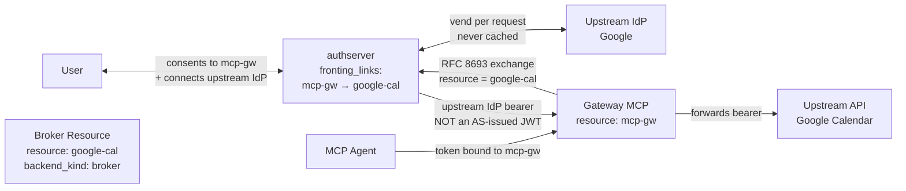
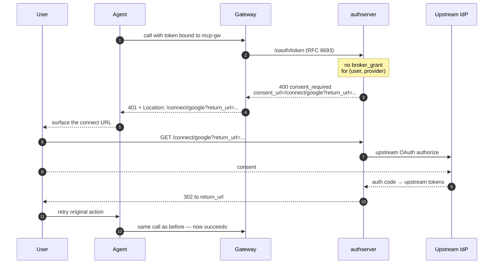

# MCP Gateway → Broker Resource

*Context: part of [Topologies](README.md). Start with the decision tree if you haven't.*

> **At a glance.** A gateway MCP fronts a
> [Broker Resource](../concepts/glossary.md#glossary-broker-backend)
> (an upstream-IdP-backed service like Google Calendar or GitHub) via
> a [fronting link](../concepts/glossary.md#glossary-fronting-link).
> The [agent](../concepts/glossary.md#glossary-agent) never sees the
> broker. The token sent downstream is **the upstream IdP's bearer**,
> not an AS-issued [JWT](../concepts/glossary.md#glossary-jwt) — the
> [act-claim](../concepts/glossary.md#glossary-act-claim)
> [chain](../concepts/glossary.md#glossary-agent-chain) therefore
> lives only in the AS audit log. Total encapsulation.

## Topology



The components:

- **Gateway MCP** — same shape as in
  [mcp-gateway-mint.md](mcp-gateway-mint.md): a
  [Mint Resource](../concepts/glossary.md#glossary-mint-backend) and a
  confidential OAuth client.
- **Broker Resource** — `backend_kind: broker`, points at a
  `broker_provider` row.
- **Upstream IdP** — Google, GitHub, etc. The bearer it issues is the
  one the upstream API will accept.
- **Fronting link** — declares that the gateway may
  [exchange tokens](../concepts/glossary.md#glossary-token-exchange)
  for the broker on behalf of authorized agents.

> **Common mistake — `fronting_link_missing` error.** If the
> agent's first token-exchange call returns
> `400 invalid_request` with `error_description` containing
> "no fronting link declared from <gateway-slug> to <broker-slug>",
> your gateway is calling token-exchange against a Broker Resource
> without declaring the link first. Either:
>
> - Declare `fronting_links(<gateway>, <broker>)` (this page,
>   [How to configure](#how-to-configure)), or
> - If the agent is meant to talk to the broker directly without a
>   gateway, use [broker-mcp.md](broker-mcp.md) instead.

## Flow

### Happy path (user has connected the upstream IdP)

```mermaid
sequenceDiagram
    autonumber
    participant Ag as Agent
    participant GW as Gateway &#40;mcp-gw&#41;
    participant AS as authserver
    participant IdP as Upstream IdP
    participant API as Upstream API

    Ag->>GW: call with token bound to mcp-gw<br/>X-Requested-Scope: tool:list
    GW->>AS: POST /oauth/token (RFC 8693)<br/>Basic auth (gateway creds)<br/>subject_token = agent bearer<br/>resource = google-cal
    Note over AS: fronting_links lookup hit<br/>broker_grants(user, google) hit<br/>BrokerIssuer dispatches
    AS->>IdP: refresh / vend with stored credential
    IdP-->>AS: upstream bearer (narrowed scopes)
    AS-->>GW: upstream IdP bearer<br/>(NOT an AS-issued JWT)
    GW->>API: call with upstream bearer
    API-->>GW: response
    GW-->>Ag: response
    Note over AS: audit row written<br/>type=broker_dispatch chain_kind=fronted target_kind=broker
```



### `consent_required` recovery (first-time or refresh failure)



The same response shape fires when the upstream refresh token has
expired and re-consent is needed. The gateway returns the same 401 +
`Location`; only the AS audit log distinguishes "missing connection"
from "refresh failed" via the `DeniedReason` detail.

## When to use

- The hidden Resource is backed by an upstream IdP and the upstream
  API expects its own bearer token on the wire.
- You want the agent to see only the gateway, never the broker
  resource or the upstream provider name.
- You're OK with the act-chain living only in AS audit (the upstream
  bearer cannot carry it).

**Don't use when:**

- The hidden Resource is itself a Mint Resource →
  [mcp-gateway-mint.md](mcp-gateway-mint.md) preserves the chain in
  the JWT.
- You don't need encapsulation; the agent can see the broker directly
  → [broker-mcp.md](broker-mcp.md).

## How to configure

Five operations: (1) register the upstream provider; (2) register the
Mint Resource (gateway-facing); (3) register the Broker Resource;
(4) create the fronting link; (5) register the gateway as a
confidential client.

**AS process environment.** Before configuring the resources below,
the authserver process itself needs three env vars exported. Without
them `/connect/{provider}` returns `503 service_unavailable`
(`feature_disabled` naming `connect.state_secret`) or token-exchange
returns `consent_required` with no `consent_url`:

```bash
# Signs the state token threaded through /connect → upstream IdP → /callback.
# Empty → /connect/{provider} returns 503 feature_disabled
# (api/public/connection/routes.go).
export AUTHPLANE_CONNECT_STATE_SECRET=$(openssl rand -base64 32)

# Base URL the AS uses to build the absolute consent_url returned in
# `consent_required` token-exchange responses. Empty → consent_required
# arrives with no `consent_url` field (omitempty), and the AS logs:
#   "emitting consent_required without consent_url —
#    connect.redirect_base_url is not configured"
export AUTHPLANE_CONNECT_REDIRECT_BASE_URL=http://localhost:9000

# Upstream IdP client secret. Name must match the allowlist callout
# below.
export CONNECTOR_GOOGLE_SECRET=<google-oauth-client-secret>
```

Confirm at startup with the log line `"upstream-connection support
enabled"` — printed only when both `AUTHPLANE_CONNECT_STATE_SECRET`
and the keyring/encryptor are configured
(`cmd/authserver/serve.go`).

**Env var name allowlist.** The upstream OAuth client secret is
**not** stored in the AS database — authserver reads it via
`client_secret_ref`. The brokerproto/oauth adapter rejects any value
that does not match
`^(CONNECTOR_|AUTHPLANE_VAULT_)[A-Z][A-Z0-9_]*$`
(`internal/brokerproto/secretrules.go`). The prefix prevents
operator-supplied config from naming arbitrary process env vars
(`PATH`, `AWS_*`, …) and having the adapter return their values as a
"client secret". Pick `CONNECTOR_*` for upstream OAuth apps,
`AUTHPLANE_VAULT_*` for vault-managed secrets — anything else fails
at vend time with `errSecretLookup: invalid env var name`.

**Google requires `extra_auth_params` for refresh tokens.** Google
only issues a `refresh_token` when the authorize URL carries
`access_type=offline` AND `prompt=consent`. Without `prompt=consent`,
users who have already approved the client get a token response with
no refresh token, and `CompleteConnect` fails with
`oauth upstream did not return a refresh_token`. The snippets below
set both — drop them only if you've confirmed your upstream issues
refresh tokens unconditionally.

### Via Admin UI (`http://localhost:9001`)

1. Open **Providers** → **New provider**. Slug `google`, kind `oauth`,
   client_id `<google-oauth-client-id>`, client secret env
   `CONNECTOR_GOOGLE_SECRET`, authorize URL
   `https://accounts.google.com/o/oauth2/v2/auth`, token URL
   `https://oauth2.googleapis.com/token`. Under **Extra auth params**
   add `access_type=offline` and `prompt=consent`. Save.
2. Open **Resources** → **New resource**. Create `mcp-gw` (Mint, URI
   `https://mcp-gw.example.com`, scopes `tool:list`, `tool:create`).
3. Same page, **New resource** again. Create `google-cal` (Broker,
   provider `google`, URI `https://google-cal.broker.example.com`,
   scopes `tool:list`, `tool:create`).
4. Open **Fronting** → **New link**. Source `mcp-gw`, target
   `google-cal`. Scope map `tool:list → tool:list`,
   `tool:create → tool:create`.
5. Open **Clients** → **New client**. Same shape as
   [mcp-gateway-mint.md](mcp-gateway-mint.md) Admin UI Step 4 with
   scope `tool:list tool:create`.

### Via CLI

```bash
cat >/tmp/provider-google.json <<EOF
{
  "client_id": "<google-oauth-client-id>",
  "client_secret_ref": "CONNECTOR_GOOGLE_SECRET",
  "authorize_url": "https://accounts.google.com/o/oauth2/v2/auth",
  "token_url": "https://oauth2.googleapis.com/token",
  "extra_auth_params": {
    "access_type": "offline",
    "prompt": "consent"
  }
}
EOF

# 1. Provider.
authserver admin provider create \
  --slug=google --display-name="Google" --protocol=oauth \
  --config-data=/tmp/provider-google.json

# 2. Mint resource (gateway-facing).
authserver admin resource create \
  --slug=mcp-gw \
  --backend-kind=mint \
  --uri=https://mcp-gw.example.com \
  --display-name="MCP Gateway" \
  --scopes='tool:list||List tools' \
  --scopes='tool:create||Create tools'

# 3. Broker resource. The CLI's --broker-provider flag takes the
#    provider's UUID id (NOT the slug — only the REST API resolves
#    broker_provider_slug). Look the id up by slug:
PROV_ID=$(authserver admin provider list --json |
  jq -r '.[] | select(.slug=="google") | .id')

authserver admin resource create \
  --slug=google-cal \
  --backend-kind=broker \
  --broker-provider="$PROV_ID" \
  --uri=https://google-cal.broker.example.com \
  --display-name="Google Calendar" \
  --scopes='tool:list|https://www.googleapis.com/auth/calendar.readonly|List' \
  --scopes='tool:create|https://www.googleapis.com/auth/calendar|Create'

# 4. Fronting link.
#
# CLI caveat: the --scope-map flag splits each entry on its FIRST
# ':' (source vs target separator). Source-side scope names that
# themselves contain ':' (e.g. "tool:list") cannot be expressed in
# this flag — the parser will reject them. Workaround: register
# scope names without ':' (e.g. "tool_list"), OR use the REST/UI
# blocks below for this step. The CLI line below assumes the scopes
# in steps 2 and 3 above are renamed to "tool_list"/"tool_create".
authserver admin fronting create \
  --source=mcp-gw \
  --target=google-cal \
  --scope-map='tool_list:tool_list,tool_create:tool_create'

# 5. Confidential gateway client.
authserver admin client create \
  --name="mcp-gw" \
  --grant-types=client_credentials,urn:ietf:params:oauth:grant-type:token-exchange \
  --auth-method=client_secret_basic \
  --scope="tool:list tool:create"
```

### Via REST API

```bash
ADMIN=http://localhost:9001
KEY=dev-admin-key-localhost-only

# 1. Provider
curl -X POST "$ADMIN/admin/broker-providers" \
  -H "Authorization: Bearer $KEY" -H "Content-Type: application/json" \
  -d '{"slug":"google","display_name":"Google","protocol":"oauth",
       "config_data":{
         "client_id":"<google-oauth-client-id>",
         "client_secret_ref":"CONNECTOR_GOOGLE_SECRET",
         "authorize_url":"https://accounts.google.com/o/oauth2/v2/auth",
         "token_url":"https://oauth2.googleapis.com/token",
         "extra_auth_params":{"access_type":"offline","prompt":"consent"}
       }}'

# 2. Mint resource
curl -X POST "$ADMIN/admin/resources" \
  -H "Authorization: Bearer $KEY" -H "Content-Type: application/json" \
  -d '{"slug":"mcp-gw","display_name":"MCP Gateway",
       "backend_kind":"mint","uri":"https://mcp-gw.example.com",
       "scopes":[{"name":"tool:list"},{"name":"tool:create"}]}'

# 3. Broker resource
curl -X POST "$ADMIN/admin/resources" \
  -H "Authorization: Bearer $KEY" -H "Content-Type: application/json" \
  -d '{"slug":"google-cal","display_name":"Google Calendar",
       "backend_kind":"broker","broker_provider_slug":"google",
       "uri":"https://google-cal.broker.example.com",
       "scopes":[
         {"name":"tool:list",
          "upstream":"https://www.googleapis.com/auth/calendar.readonly"},
         {"name":"tool:create",
          "upstream":"https://www.googleapis.com/auth/calendar"}
       ]}'

# 4. Fronting link
curl -X POST "$ADMIN/admin/fronting" \
  -H "Authorization: Bearer $KEY" -H "Content-Type: application/json" \
  -d '{"source":"mcp-gw","target":"google-cal",
       "scope_map":{"tool:list":["tool:list"],"tool:create":["tool:create"]}}'

# 5. Confidential gateway client
curl -X POST "$ADMIN/admin/clients" \
  -H "Authorization: Bearer $KEY" -H "Content-Type: application/json" \
  -d '{"client_name":"mcp-gw",
       "grant_types":["client_credentials","urn:ietf:params:oauth:grant-type:token-exchange"],
       "token_endpoint_auth_method":"client_secret_basic",
       "scope":"tool:list tool:create"}'
```

### Run the gateway

See [`examples/typescript/04-broker-upstream/`](../../examples/typescript/04-broker-upstream/)
for the runnable broker-front pattern and the `consent_url` handling. A
ready-to-run dedicated gateway example is not shipped today.

## How authserver handles it

The exchange goes through `TokenExchangeService` → `BrokerIssuer`:

| Step | AS-side action |
|---|---|
| Authenticate caller | Validates Basic auth → resolves the gateway's `client_id`. |
| Resolve `subject_token` | Pulls out `aud` (= `mcp-gw` URI) and `sub` (= agent). |
| Per-MCP consent gate | `consent_grants(user, agent, mcp-gw)` lookup — required at the **source** MCP. |
| Fronting-link gate | `fronting_links(source=mcp-gw, target=google-cal)` lookup — hit → fronted path. The fronting link bypasses the broker actor-attestation gate that would otherwise require `policy.runtime.client_ids`. |
| `broker_grants` lookup | `broker_grants(user, google_provider)` — miss → returns `consent_required` with `consent_url`. |
| Vend | `output.BrokerProtocol` adapter (`oauth` for Google) calls upstream `token_url` with the stored refresh token; per request, never cached. Three-bound enforcement: requested ⊆ `consent_grants.scopes` ⊆ `broker_grants.scopes_granted`. |
| Issue + audit | `issuances(subject_user_id, client_id, resource_id=google-cal, agent_id, agent_chain)` row written. `audit_events` action `token.exchanged`; `detail` records `type=broker_dispatch chain_kind=fronted target_kind=broker via_link=mcp-gw->google-cal`. **The wire token (upstream bearer) carries no chain claims** — the chain is audit-only. |

Tables touched: `resources`, `clients`, `broker_providers`,
`fronting_links`, `consent_grants` (lookup), `broker_grants`,
`connect_pending_states`, `issuances`, `audit_events`.

### Current limitation: static `return_url`

The gateway's `--connect-return-url` flag is a process-level config —
every `consent_required` response uses the same URL. A production
gateway would encode the originating request path so the user lands
back on the right page, but that requires a GW-supplied `return_url`,
which is not implemented yet.

### Operator triage

Failed Broker dispatches emit `recordDenied(...)` calls in
`token_exchange.go`. Each surfaces in two places:

- **Audit log:** `audit_events.detail` carries `reason=<code>` (and
  for fronted-broker calls, the full
  `type=broker_dispatch chain_kind=fronted target_kind=broker via_link=… denied_reason=<code>` shape).
- **Metric:** the `authplane_token_exchange_denied_total{reason=<code>}`
  counter increments. (Successful dispatches use a separate counter,
  `authplane_token_exchange_total{kind, source, target}`.)

Common reasons specific to broker dispatch:

| `reason` | What it means | Operator action |
|---|---|---|
| `broker_consent_required` | The user has not connected the upstream IdP yet | Direct the user through the connect URL surfaced by the gateway |
| `broker_scope_not_consented` | Requested scopes exceed what the user granted at the upstream | Re-prompt the user to re-grant the missing scopes |
| `provider_lookup_failed` / `provider_missing` | The Broker Resource references an unknown or unreachable provider | Check `broker_providers` registration and network reachability |
| `fronting_link_missing` | Subject token's `aud` resolves to a Mint Resource but no `fronting_links` row connects it to the Broker target | Declare `fronting_links(<source>, <target>)` — this is the canonical Mint→Broker wiring |
| `agent_attestation_unknown_actor` | Caller's `client_id` isn't bound to any Resource via `runtime.client_ids` (defense-in-depth path; subject token's `aud` doesn't resolve to any Mint) | Add the caller to the actor MCP's `runtime.client_ids` — see [runtime-client-binding.md](../guides/integrate/runtime-client-binding.md) |
| `fronting_lookup_failed` / `fronting_scope_unmapped` | Fronting link is misconfigured | Inspect the fronting link's `scope_map` |
| `operator_gate_denied` | `policy.exchange.allowed_client_ids` rejected the caller | Add the gateway's `client_id` to the actor allowlist |

The full set of `reason` codes lives in `internal/services/token_exchange.go`
(search for `recordDenied`); see the
[Observability guide](../guides/deploy/observability-prometheus-otel.md) for the metric label set.

## Verify it

Because the wire token is the upstream bearer (often opaque,
sometimes a Google JWT), the act-chain lives **only** in the AS audit
log:

```bash
sqlite3 data/authserver.db \
  "SELECT created_at, actor_id, action, detail FROM audit_events
   WHERE action = 'token.exchanged'
     AND detail LIKE '%type=broker_dispatch%'
     AND detail LIKE '%chain_kind=fronted%'
   ORDER BY created_at DESC LIMIT 5;"
```

`detail` carries `type=broker_dispatch chain_kind=fronted target_kind=broker
via_link=mcp-gw->google-cal`, with the original agent's `sub` carried
on the `audit_events.actor_id` column.

## See also

- [mcp-gateway-mint.md](mcp-gateway-mint.md) — sibling pattern for
  Mint targets (preserves chain on the wire).
- [broker-mcp.md](broker-mcp.md) — non-fronted variant (agent talks
  to the broker directly).
- [Upstream Connections SDK](../guides/upstream-providers/connecting-providers.md).
- [Glossary](../concepts/glossary.md) — Broker backend, Mint backend, fronting link, agent, JWT, act claim, agent chain, token exchange.
