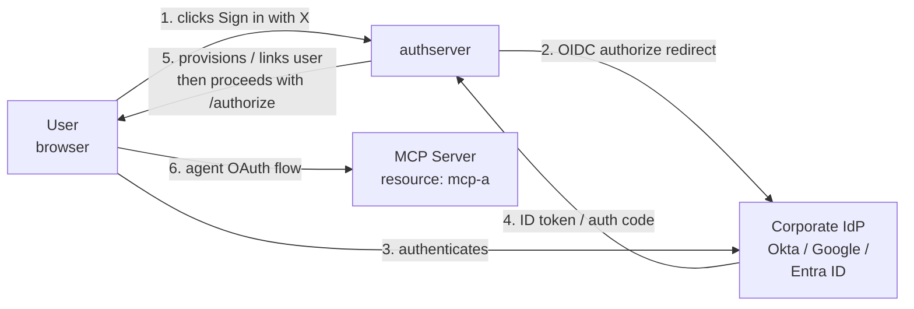
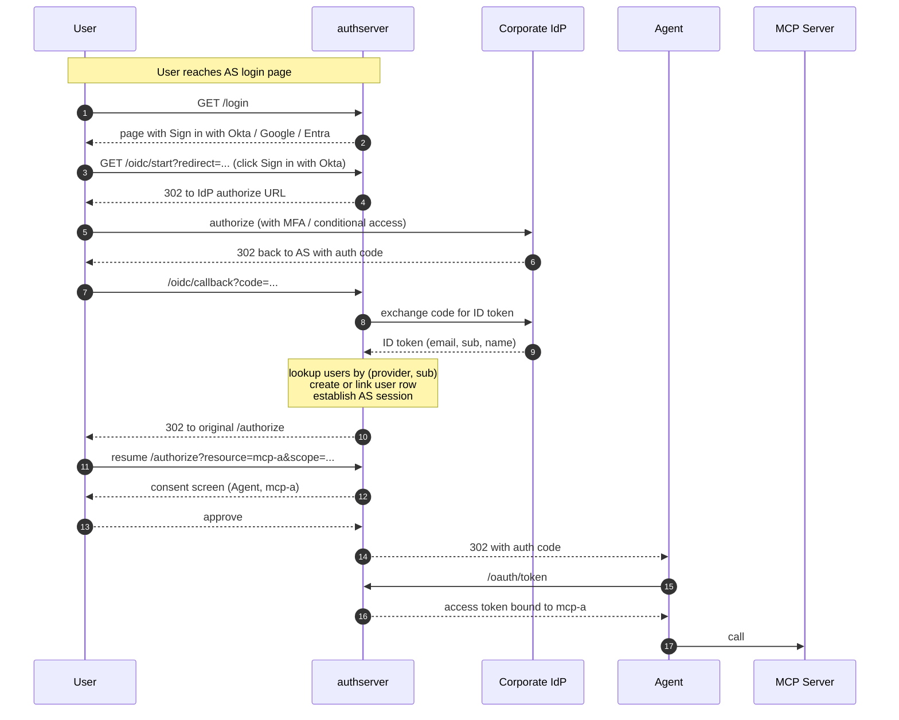

# OIDC-Federated User Login

*Context: part of [Topologies](README.md). Start with the decision tree if you haven't.*

> **At a glance.** Users sign into authserver via their corporate IdP
> (Google Workspace, Okta, Microsoft Entra). authserver does not store
> passwords — it accepts the upstream IdP's ID token claims, then
> creates or links a local user account and runs the
> [OAuth 2.1](../concepts/glossary.md#glossary-oauth-2-1) flow as
> normal. Per-user audit. Shipped at v0.1.x.

## Topology



The components:

- **Corporate IdP** — owns the user's credentials and (typically) MFA
  policy. authserver delegates "who is this user" entirely to it.
- **authserver** — the
  [Authorization Server](../concepts/glossary.md#glossary-authorization-server)
  accepts ID token claims at login, then proceeds with normal
  `/authorize` → [consent](../concepts/glossary.md#glossary-consent) →
  `/oauth/token`. authserver still owns OAuth client +
  [Resource](../concepts/glossary.md#glossary-resource) definitions;
  the IdP is upstream *only* for human authentication. ID token
  signatures are verified against the upstream IdP's
  [JWKS](../concepts/glossary.md#glossary-jwks).

The downstream flow (consent, token issuance, MCP call) is the
ordinary [single-mcp.md](single-mcp.md) shape — federation only
changes who answers "who is this user".

## Flow



The federation step is purely the "log in" stage. Once authserver
holds a session for the user, the rest is the standard
[single-mcp.md](single-mcp.md) shape.

## When to use

- Your organization runs Google Workspace, Okta, Entra ID, or any
  OIDC-compliant IdP for SSO.
- You don't want authserver storing passwords.
- You want corporate MFA, conditional access, or session policies
  enforced at the IdP, not duplicated in authserver.

**Don't use when:**

- You need agent-side (M2M) federation — that's
  [enterprise-xaa.md](enterprise-xaa.md) (RFC 7523), a different
  problem.
- You only need API tokens, no human login →
  [m2m-client-credentials.md](m2m-client-credentials.md).

## How to configure

> **Single-mode topology.** OIDC federation is **boot-time YAML
> config only** at v0.1.x — there is no Admin UI page, CLI
> subcommand, or REST endpoint for runtime federation-provider
> management. Edit `oidc:` in the AS config, restart the AS. (Once the
> AS is running with federation enabled, every other operation on this
> page — Resources, Clients — is available in all three modes; see
> [single-mcp.md](single-mcp.md) Configure section.)
>
> **Single-provider.** The default configuration supports one upstream
> OIDC IdP at a time.

Full per-provider setup with screenshots and gotchas:
[oidc.md](../guides/federation/oidc.md). The relevant YAML shape
(every key matches the `OIDCConfig` struct in
`internal/config/config.go`):

```yaml
oidc:
  enabled: true
  issuer: https://your-org.okta.com
  client_id: <okta-app-id>
  # Set exactly one of client_secret (inline) or client_secret_ref (env var
  # name) — they are mutually exclusive; configuring both fails validation.
  client_secret_ref: CONNECTOR_OIDC_CLIENT_SECRET
  display_name: Okta            # button text on the login page
  scopes: [openid, email, profile]
  redirect_uri: https://authserver.example.com/oidc/callback
  show_local_login: true        # false disables password login entirely (form hidden, POST /login → 404)
  include_groups_scope: true    # auto-include "groups" scope when supported
  connector_id: ""              # Dex connector_id, optional
```

Claim handling and user provisioning are not YAML-configurable —
`sub` maps to `users.provider_sub`, `email` to `users.email`, and
auto-provisioning is on by default. See
[oidc.md](../guides/federation/oidc.md) for claim requirements and
provisioning behavior.

## How authserver handles it

| Phase | AS-side state |
|---|---|
| Login click | AS (via the federation service `internal/services/oidc.go`) redirects to the provider's authorize URL with PKCE. |
| Callback | AS exchanges the auth code for an ID token at the provider's `token_url`. Validates ID-token signature against the provider's JWKS. |
| User reconciliation | Looks up `users` by (`provider`, `provider_sub`). If new, creates a `users` row with the upstream `email`. |
| Audit | Emits `audit_events.action = user.oidc_login` on success, `user.oidc_login_failed` on rejection. |
| Session | Establishes an AS browser session for the user. |
| Resumed `/authorize` | Continues the original OAuth request from where it left off. From here on, the flow is identical to [single-mcp.md](single-mcp.md). |

Tables touched: `users` (with `provider`, `provider_sub` columns
holding the federation linkage), plus the standard `consent_grants` /
`issuances` flow on the OAuth side. There is no separate
federation-identities table — the mapping lives directly on `users`.

## Verify it

Confirm the user row records the federation source:

```bash
sqlite3 data/authserver.db \
  "SELECT id, email, provider, provider_sub
   FROM users WHERE email = '<email>';"
```

Audit query (login events):

```bash
sqlite3 data/authserver.db \
  "SELECT created_at, action, detail FROM audit_events
   WHERE action IN ('user.oidc_login','user.oidc_login_failed')
   ORDER BY created_at DESC LIMIT 5;"
```

## See also

- [oidc.md](../guides/federation/oidc.md) — full per-provider
  setup with screenshots and gotchas.
- [single-mcp.md](single-mcp.md) — what the OAuth flow looks like
  once federation is done.
- [enterprise-xaa.md](enterprise-xaa.md) — the agent-side analogue
  for IdP-asserted *agent* identity (not user identity).
- [Glossary](../concepts/glossary.md) — OAuth 2.1, Authorization Server, consent, Resource, JWKS, [agent](../concepts/glossary.md#glossary-agent), [access token](../concepts/glossary.md#glossary-access-token).
